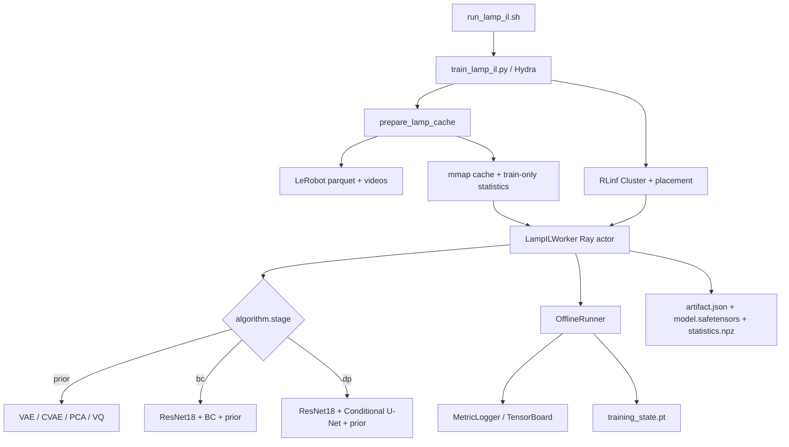
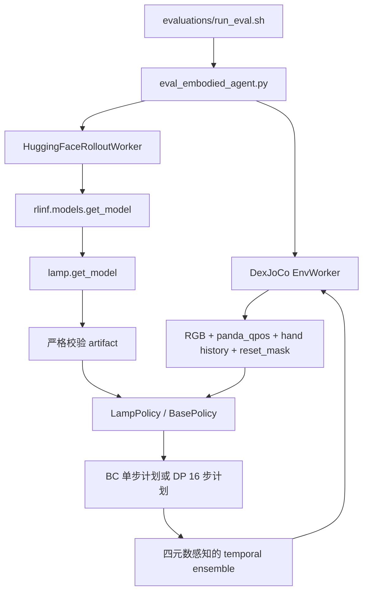
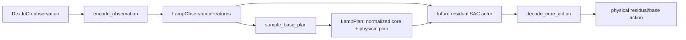

# LAMP 第二阶段迁移：代码来源、职责与架构关系

## 1. 文档目的

本文解释 LAMP 第二阶段迁移到 RLinf 后新增和修改的代码。重点回答三个问题：

1. 每个文件来自哪里：旧转换仓库中的哪类实现，还是为 RLinf 新写。
2. 每个文件负责什么：输入、输出、状态和关键约束是什么。
3. 它与整个代码库怎样连接：谁调用它、它调用谁、训练和在线推理时处于哪一层。

本文面向后续维护者，是本阶段唯一保留的迁移说明。用户快速上手文档、README 导航、Docker、CI 和 E2E 接入暂不纳入本次修改；训练环境安装入口随代码保留。

### 1.1 迁移来源

主要算法来源是旧转换仓库：

```text
/vepfs-mlp2/c20250301/240906020/dexjoco/rlinf/
└── lamp/imitation_learning/
    ├── common/
    ├── data/
    ├── models/
    ├── pretrain/
    ├── behavior_clone/
    └── diffusion_policy/
```

第三阶段 residual RL 的接口需求来源于：

```text
/vepfs-mlp2/c20250301/240906020/dexjoco/rlinf/docs/
sim_residual_sac_implementation.md
```

迁移不是将旧目录整体复制进 RLinf。数学语义尽量保留，但训练组织、配置、日志、
checkpoint、模型注册、在线评估和数据缓存均改为 RLinf 原生方式。

### 1.2 三类文件

| 类别 | 含义 | 典型文件 |
|---|---|---|
| 算法移植 | 从旧 LAMP Torch/JAX 对齐实现迁移，并改为目标仓库命名空间、动态 latent dim 和 compile 友好语义 | `hand_vae.py`、`hand_cvae.py`、`single_arm_diffusion_policy.py` |
| RLinf 原生新增 | 旧仓库没有对应职责，为适配 Worker/Runner、Hydra、artifact、mmap、在线推理而新写 | `lamp_il_worker.py`、`artifact_io.py`、`policy_wrapper.py`、`offline_dataset.py` |
| RLinf 接入修改 | 在现有注册表、env worker、rollout worker、日志和评估入口中增加 LAMP 分支 | `rlinf/config.py`、`rlinf/models/__init__.py`、`env_worker.py` |

## 2. 总体架构

### 2.1 训练链路



`train_lamp_il.py` 只负责配置、缓存预构建、Cluster/placement 和 group 启动。
训练状态完全位于 `LampILWorker` 内；循环编排、日志和保存触发复用
`OfflineRunner`。

### 2.2 在线评估链路



在线推理不加载 optimizer、scheduler 或旧 checkpoint。它只接受本迁移定义的部署
artifact，避免训练状态与部署状态耦合。

### 2.3 第三阶段预留链路



第二阶段只提供接口和稳定的数据契约，不实现 SAC replay buffer、Q 网络或更新循环。

## 3. 模型目录逐文件说明

目录：`rlinf/models/embodiment/lamp/`

### 3.1 `__init__.py`

- **来源**：RLinf 原生新增；旧仓库没有 RLinf 模型工厂。
- **职责**：实现 `get_model(cfg, torch_dtype)`，作为 `rlinf/models/__init__.py`
  中 `lamp_bc` 和 `lamp_dp` 的注册构造器。
- **输入**：rollout 的 Hydra model config，其中 `model_path` 指向部署 artifact。
- **处理**：校验 artifact 的 schema/hash/model type/spec；按 metadata 创建 BC、单臂 DP
  或双臂 DP core；创建 `LampPolicy`；严格加载 state dict。
- **关系**：只用于部署/评估加载。训练时 `LampILWorker` 直接创建 core，以便加载 prior、
  创建 optimizer 和保存精确恢复状态。
- **约束**：config 中声明的 prior type 和 latent dim 必须与 artifact 相同，不允许静默覆盖。

### 3.2 `constants.py`

- **来源**：由旧 `lamp/imitation_learning/common/constants.py` 迁移并整理。
- **职责**：集中定义任务集合、数据清洗任务到环境任务的别名、单/双臂维度、数组切片和
  相机 key。
- **关系**：数据读取、动作转换、策略和 worker 都依赖它；它是 shape contract 的单一来源。
- **重要维度**：单臂原始策略动作 22 维（3 position + 3 rotvec + 16 hand），
  在线物理动作 23 维（3 position + 4 quaternion + 16 hand）；双臂分别为 44/46 维。

### 3.3 `single_arm_actions.py`

- **来源**：旧 `common/actions.py`。
- **职责**：单臂 rotation-vector、`wxyz` quaternion、策略动作和环境动作之间的确定性转换。
- **关键行为**：规范化旋转向量分支、固定四元数符号序列，避免相同旋转因 `q` 与 `-q`
  产生不连续监督信号。
- **关系**：LeRobot 预处理生成 23 维 quaternion target；部署 wrapper 将模型输出送给环境。

### 3.4 `bimanual_actions.py`

- **来源**：旧 `common/bimanual_actions.py`。
- **职责**：拆分双臂 state/action、分别转换左右手旋转表示，并在模型内部顺序与 DexJoCo
  wrapper 顺序之间重排。
- **顺序约束**：模型内部按 `[right_23, left_23]` 处理；DexJoCo env action 按
  `[right_arm_7, left_arm_7, right_hand_16, left_hand_16]` 接收。

### 3.5 `resnet18.py`

- **来源**：旧 `models/resnet18.py` 的 Torch/Hugging Face 版本，按 RLinf 打包方式重构。
- **职责**：加载本地 Hugging Face ResNet-18，执行 ImageNet 归一化和全局平均池化，输出
  512 维视觉特征。
- **输入契约**：`[B,3,H,W]`、float、范围 `[0,1]`。
- **为什么不复用通用 CNN policy**：RLinf 的通用 CNN policy 面向在线 state/image SAC/PPO，
  其网络拓扑和输入融合方式不是 LAMP checkpoint/算法定义。这里复用 Hugging Face
  `ResNetModel`，保留 LAMP 的双/三视角融合结构。
- **compile**：模型中没有 Python 数据依赖控制流；权重加载发生在 compile 前。

### 3.6 `hand_vae.py`

- **来源**：旧 `models/vae.py`。
- **职责**：八帧 16 维手部历史的 temporal convolutional VAE。
- **迁移增强**：`latent_dim` 不再写死；encoder 的 `mu/log_var` head 和 decoder 输入均由
  config 生成。
- **训练输出**：重建损失、KL、加权总损失、latent 统计。
- **下游**：BC 使用 prior mean/log variance 作为条件并冻结 VAE；DP 可使用 VAE latent
  作为 hand core action。

### 3.7 `hand_cvae.py`

- **来源**：旧 `models/cvae.py`。
- **职责**：条件 VAE。历史八帧是 condition，未来 16 步手部轨迹是 posterior target。
- **迁移增强**：动态 `latent_dim`；支持 mask；暴露 prior/posterior encode 和 decoder，便于
  DP target 预计算和第三阶段使用。
- **下游**：DP 默认使用 CVAE posterior latent 作为离线监督 core；推理时使用历史条件的
  prior 信息。

### 3.8 `hand_pca.py`

- **来源**：旧 `models/pca.py` 和 `pretrain/pca/fit.py` 的核心数学。
- **职责**：对手部动作拟合确定性 PCA，提供 encode/decode、重建 MSE/MAE 和 explained
  variance 指标。
- **迁移增强**：component 符号规范化，使相同数据跨运行得到稳定 latent 方向；
  `latent_dim` 由 config 决定。
- **训练特点**：PCA 无梯度更新，worker 在一步内拟合、记录指标并保存 artifact。

### 3.9 `hand_vq_vae.py`

- **来源**：旧 `models/vq_vae.py`。
- **职责**：residual vector quantization hand prior，包含 encoder、多个 codebook、EMA 更新和
  decoder。
- **compile 关键改动**：forward 可返回 `ema_counts/ema_sums`，worker 在编译图外调用
  `apply_ema_updates()`。这样避免 Dynamo 图内原地修改 codebook buffer 导致 graph break、
  recompilation 或错误捕获状态。
- **动作空间契约**：只对 VQ 使用 DexJoCo Allegro actuator `ctrlrange` 作为固定物理上下界，
  训练前 clip 并线性映射到 `[-1,1]`。导出时先恢复到物理手部动作空间，再执行 PCA 排序；
  DP 最近邻和策略解码都直接消费物理 codebook，不再复用 train-only z-score。
- **兼容行为**：普通 eager 调用仍可选择内部更新；训练 worker 明确使用外部更新路径。

### 3.10 `bc_policy.py`

- **来源**：旧 `models/bc_policy.py` 与 `behavior_clone/train.py` 中的损失所需输出。
- **职责**：单臂双视角行为克隆：front ResNet + wrist ResNet + Panda state MLP + hand prior
  condition MLP，再经 trunk 输出 arm action 与 hand latent/correction。
- **prior 模式**：`vae` 模式冻结并复用 VAE decoder；`mlp` 模式直接预测 16 维手部动作。
- **迁移增强**：VAE latent dim 动态；`return_aux=True` 返回 raw features、prior mean、
  correction 和无视觉修正基线，供分项 loss、日志和第三阶段使用。
- **限制**：当前 BC 仅实现单臂，与旧算法范围一致。

### 3.11 `diffusion_math.py`

- **来源**：旧 `diffusion_policy/diffusion.py`。
- **职责**：cosine beta schedule、加噪、epsilon 到 `x0`、DDIM step 和推理 timestep。
- **关系**：单/双臂 DP 共享；不持有模型参数。

### 3.12 `conditional_unet1d.py`

- **来源**：旧 `diffusion_policy/unet.py`。
- **职责**：一维 conditional U-Net，对 `[B,H,core_dim]` 的 noisy core plan 预测噪声。
- **条件**：timestep sinusoidal embedding 与视觉/状态/prior observation condition。
- **迁移注意**：时间长度匹配逻辑显式处理上/下采样边界，保持固定 16 步 horizon。

### 3.13 `single_arm_diffusion_policy.py`

- **来源**：旧 `diffusion_policy/policy.py`、`training.py` 和 `eval.py` 的核心模型逻辑合并。
- **职责**：单臂 DP，组合两个 ResNet、state encoder、hand prior、conditional U-Net、
  diffusion loss、DDIM sampling 和 core decoder。
- **core action**：7 维 quaternion arm core 加 prior-dependent hand core。VAE/CVAE/PCA 使用
 连续 latent；VQ 使用归一化 code index 表示。
- **输出**：训练返回总 diffusion loss 和按 arm/hand 拆分的噪声误差；推理返回 16 步
  physical plan 及 normalized core plan。
- **第三阶段关系**：`_encode_observation`、`_ddim_sample` 和 `_decode_core` 被
  `LampPolicy` 以稳定公共方法包装。

### 3.14 `bimanual_diffusion_policy.py`

- **来源**：旧 `diffusion_policy/bimanual_policy.py`、`train_bimanual.py` 和
  `eval_bimanual.py` 的模型逻辑。
- **职责**：双臂三视角 DP。左右 arm state、hand history 和 hand prior 独立，最终拼接为
  一个 joint diffusion core。
- **prior 约束**：左右 prior artifact 分开加载，type 可相同但 latent dim 分别校验。
- **输出关系**：内部输出 right/left 连续布局，外层 `LampPolicy` 负责转成 env 顺序。

### 3.15 `il_training_utils.py`

- **来源**：旧 `common/training.py` 的 schedule、batch sampler、统计和 run metadata 工具，
  保留可复用数学；RLinf worker 只使用其中与优化和统计相关的部分。
- **职责**：cosine warmup schedule、beta warmup、Torch runtime/TF32 设置、归一化统计、
  batch/index 工具。
- **关系**：具体训练循环不在此处，而在 `LampILWorker`；这样 Runner/Worker 生命周期仍由
  RLinf 管理。

### 3.16 `artifact_io.py`

- **来源**：RLinf 原生新增。
- **职责**：定义 schema version 1 的部署 artifact 和精确训练恢复格式。
- **部署 artifact**：
  - `artifact.json`：模型类型、架构、task、dataset fingerprint、policy spec、统计 key 和
    resolved training contract、模型/统计文件 SHA-256 及 metadata SHA-256。
  - `model.safetensors`：纯 tensor state dict，不执行 pickle。
  - `statistics.npz`：训练 split 的归一化统计。
- **训练 checkpoint**：`training_state.pt` 另存模型、optimizer、scheduler、sampler、Torch/
  CUDA/NumPy RNG 和严格 resume metadata；CVAE/VQ/DP 的 seed、optimizer、batch、horizon、
  compile、validation 与 model 配置都参与 resume 比较。
- **为什么分开**：在线 rollout 不应加载 optimizer/pickle；训练恢复则必须保留完整状态。
- **旧 ckpt**：按用户要求不提供兼容加载路径。

### 3.17 `hand_prior_artifact.py`

- **来源**：RLinf 原生新增，封装旧 prior 数学。
- **职责**：按 metadata 构造 VAE/CVAE/PCA/VQ；严格校验 task、数据 fingerprint、hand side
  和 type；提供 buffer-only `TorchHandPCA`。
- **VQ 导出**：`sorted_vq_codebook()` 用确定性主方向排序 code，避免运行间离散 code 导出
  顺序漂移。
- **关系**：BC/DP setup 使用它加载 prior；在线策略的 prior 已作为 core state 保存，无需
  另行读取 prior artifact。

### 3.18 `policy_wrapper.py`

- **来源**：RLinf 原生新增；时序集成语义参考旧 eval 脚本，接口形状按 RLinf
  `BasePolicy` 和第三阶段设计重写。
- **核心类型**：
  - `LampPolicySpec`：task、policy family、embodiment、horizon、维度、图像 key、latent dim。
  - `LampObservationFeatures`：第三阶段可消费的视觉/state/prior condition。
  - `LampPlan`：normalized core plan 与 decoded physical plan 成对保存。
  - `LampPolicy`：RLinf rollout adapter。
- **输入适配**：把 EnvWorker 的 NHWC uint8 图像转为 NCHW float；按 artifact stats 归一化
  Panda qpos 和 hand history。
- **temporal ensemble**：每个 env 独立维护历史计划；默认从 16 步计划执行 4 步；权重按
  age 指数衰减；四元数先做符号对齐再平均和归一化；`reset_mask` 只清空已 reset 的 env。
- **compile**：仅编译无状态的 `_predict_plan_from_processed`，不把 Python list 形式的
  temporal controller 放入图内，减少重编译和状态捕获风险。
- **第三阶段接口**：
  - `encode_observation(observation)`
  - `sample_base_plan(features, initial_noise=None, generator=None)`
  - `decode_core_action(core_action_norm)`
  - `freeze_base_policy()`

## 4. 数据目录逐文件说明

目录：`rlinf/data/datasets/lamp/`

### 4.1 `dexjoco_lerobot.py`

- **来源**：旧 `data/dexjoco_lerobot.py` 与 `preprocess_bc_dataset.py`。
- **职责**：读取单臂 LeRobot parquet/video，构造 history/future window，求解或校验 Panda
  inverse kinematics cache，转换 rotation action，并解码指定视频帧。
- **迁移改动**：XML 不再通过旧源码树相对路径查找，而是从已安装 `dexjoco` package
  定位；训练入口自动构建 cache，不再要求运行旧 `lamp.imitation_learning` module。
- **数据完整性**：对 parquet/meta、pose/action、solver config 和 XML 内容做 hash/版本校验。
- **关系**：只在 driver 缓存阶段直接访问 parquet/video；训练 worker 不重复解码源数据。

### 4.2 `bimanual_lerobot.py`

- **来源**：旧 `data/bimanual_lerobot.py` 与 `preprocess_bimanual_dataset.py`。
- **职责**：读取双臂 state/action 和三个视频视角；分别求解左右 Panda IK；生成右/左 hand
  history、future、mask 和 quaternion targets。
- **关系**：由 `prepare_lamp_cache()` 根据 task 名称自动选择；DP worker 读取其缓存结果。

### 4.3 `offline_dataset.py`

- **来源**：RLinf 原生新增。
- **职责**：把 LeRobot 源数据转换为 actor-local、可 mmap 的训练数据。
- **fingerprint**：由低维数据 SHA-256、视频 manifest（路径/大小/mtime）、task、相机 key、
  image size 和 split schema 共同决定。
- **split**：以 episode 为单位，seed 42，90% train / 10% validation；只有 train rows 用于统计。
- **缓存格式**：低维数组是未压缩 `.npy`；图像预先 resize 后以 uint8 `.npy` 存储；worker
  使用 `np.load(..., mmap_mode="r")`。图像契约固定为 NHWC/uint8；进入 GPU 后才转换为
  NCHW/float32 并除以 255。cache schema 2 将该布局写入 fingerprint，不能误读早期
  NCHW/float cache。
- **多进程语义**：`LampMMapDataset` 被 `spawn` 给 DataLoader worker 时只序列化文件路径，
  不序列化已打开的 `np.memmap`。每个进程在第一次 `__getitem__` 时懒加载自己的只读映射，
  并通过 PID 检测避免 fork/spawn 后复用父进程句柄。这一设计防止每个 worker 都复制整份
  图像缓存。
- **并发安全**：fingerprint 目录外使用 `fcntl` lock；`.lowdim.complete` 与
  `.images.complete` 标记阶段完成。
- **derived arrays**：DP 的 prior latent/core target 写到以 prior metadata/config hash 命名的
  namespace，避免更换 prior 后误用旧 target。
- **为什么这样设计**：消除旧 JAX/Torch 路径的 per-step parquet 读取、视频 seek、host-to-device
  小拷贝和重复 posterior 编码，是避免原速度问题的关键。

### 4.4 `__init__.py`

- **来源**：RLinf 原生新增。
- **职责**：仅导出 `LampMMapDataset`、`prepare_lamp_cache`、metadata/statistics 和 derived
  array API，缩小 entrypoint/worker 对内部实现的依赖。

## 5. Worker、Runner 与启动入口

### 5.1 `rlinf/workers/actor/lamp_il_worker.py`

- **来源**：RLinf 原生新增。loss 数学来自旧 prior/BC/DP train 脚本；生命周期按 RLinf
  `Worker` 重写。
- **定位**：第二阶段的训练核心。每次运行启动一个 Ray actor，占一张 GPU。
- **setup 分支**：
  - `_setup_prior()`：创建 VAE/CVAE/VQ，或拟合 PCA。
  - `_setup_bc()`：只允许单臂；严格加载 VAE prior；加载两个 ResNet。
  - `_setup_dp()`：按单/双臂创建 DP；严格加载 prior；预计算 core target。
- **DataLoader**：在 actor 内创建 mmap dataset；支持 pinned memory、persistent workers 和
  固定形状 micro-batch。`global_batch_size / micro_batch_size` 决定梯度累积次数；单臂 DP
  parity 配置使用 global 512、micro 512，因此每个 optimizer step 是与 JAX launcher 相同的
  单个 512-sample physical batch，梯度累积次数为 1。需要 epoch 预算时，worker 从实际
  train split 长度和 global batch 动态解析 `steps_per_epoch`。
- **determinism/resume**：`DeterministicInfiniteBatchSampler` 只按“已消费 micro-batch 数”
  推进，不受 DataLoader prefetch 影响；checkpoint 同时校验 accumulation steps，并恢复
  sampler 和 RNG。该性质保证 Torch 自身 exact resume，不表示 NumPy sampler 与 JAX
  Threefry VQ permutation 逐样本相同。
- **优化**：AdamW；ResNet backbone 使用 `backbone_lr_ratio`；cosine warmup；除 VQ 的 JAX
  recipe 明确不裁剪梯度外，其余 recipe 按配置执行全局 grad clip；FP32/TF32。
- **compile**：默认编译神经网络 loss 路径；公共配置的 `actor.compile_mode` 为 `default`，
  可显式切换为 `max-autotune-no-cudagraphs`。PCA 无神经网络更新，关闭 compile。
- **validation**：切换 `model.eval()` 并传递 `train=False` 语义；按配置遍历全部或有限 batch。
- **输出**：返回裸 metric namespace 给 `OfflineRunner`；保存训练 checkpoint 和部署 artifact。

### 5.2 `rlinf/runners/offline_runner.py`（修改）

- **来源**：RLinf 现有文件。
- **改动**：worker 返回的 `validation/`、`data/`、`time/` key 保持原 namespace；其他 key
  自动前缀为 `train/`。
- **epoch horizon**：入口在 cache 准备完成后以
  `floor(train_rows / global_batch_size)` 解析 `steps_per_epoch`；训练总步数为
  `max_epochs * steps_per_epoch`，并可继续受非负 `max_steps` 限制。`save_every_epochs` 同样在
  运行时换算为 optimizer-step 间隔；runner、worker 和学习率 schedule 共用同一结果。
- **关系**：不仅服务 LAMP，也允许其他 offline worker 使用标准指标层次。

### 5.3 `examples/embodiment/train_lamp_il.py`

- **来源**：RLinf 原生新增。
- **职责**：Hydra entrypoint；driver 预构建缓存；调用 `validate_cfg`；创建 `Cluster` 和 actor
  placement；启动 `LampILWorker` group；复用 `OfflineRunner`。
- **为什么缓存先于 Ray actor**：避免多个 worker 同时构建同一数据，并把缓存路径写回 resolve
  后的 cfg，便于日志和 checkpoint provenance；同时让 epoch/save 预算可以由 cache metadata
  解析，而不在各任务 YAML 中写死 step 数字。

### 5.4 `examples/embodiment/run_lamp_il.sh`

- **来源**：RLinf 原生新增，风格与现有 `run_embodiment.sh` 一致。
- **职责**：设置 repo/Hydra 运行环境并将 config name、Hydra override 传给 entrypoint。

## 6. Hydra 配置逐文件说明

### 6.1 公共配置

`examples/embodiment/config/dexjoco_lamp_il_base.yaml`

- 定义单节点 actor placement、OfflineRunner、MetricLogger、缓存、optimizer、compile、默认
  ResNet/prior 和空 rollout/env/reward/critic 占位。
- 默认 `actor.torch_compile: true`。
- `latent_dim` 位于 `actor.model.hand_prior.latent_dim`；双臂分别位于
  `.right.latent_dim` 和 `.left.latent_dim`。
- 虽然 LAMP worker 不执行 FSDP wrap，仍组合 RLinf 的 FSDP config，使全局
  `validate_cfg()` 接口保持一致。

### 6.2 Prior 配置

| 文件 | 功能 | 主要可配接口 |
|---|---|---|
| `dexjoco_lamp_prior_vae.yaml` | temporal VAE prior | `latent_dim`、`hidden_dim`、`beta` |
| `dexjoco_lamp_prior_cvae.yaml` | history-conditioned future CVAE | 默认 `latent_dim=3`、`kl_warmup_steps=2000`（`posterior_kl_weight=1e-4`、launcher 的 `prior_kl_weight=1e-3`） |
| `dexjoco_lamp_prior_pca.yaml` | 确定性 PCA 拟合 | `latent_dim`；只运行一步，不 compile |
| `dexjoco_lamp_prior_vq.yaml` | residual VQ-VAE | 1500 data epochs、DQ-RISE architecture；策略 core 使用离散 code |

单臂 CVAE 通用 preset 复现实际 JAX launcher 的默认训练契约：train/eval batch 分别为 256/512，
默认训练 20000 steps，
AdamW learning rate 从 `3e-4` 经 500-step warmup 后 cosine decay 到 `1e-5`，每 5000 steps
保存 checkpoint。RLinf/Torch 训练使用 eager mode，并在最后一步对完整 validation split 评估；
JAX 侧 train step 仍由 `jax.jit` 编译。六个 task-specific dim6 preset 均显式覆盖
`latent_dim=6`；为对应已选用的 JAX task recipe，click/fold 训练 20000 steps，其余四个任务训练
30000 steps，validation interval 与各自 final step 相同。JAX Python CLI 的独立 fallback 写着
`prior_kl_weight=3e-4`，但单臂 launcher 显式传入 `1e-3`，这里以实际单臂 launcher 为准。

这些 task preset 沿用当前训练输出 namespace。仓库中已存在同名 checkpoint 时，重训前必须通过
Hydra override 指定新的 `runner.logger.log_path`，否则会覆盖 checkpoint/root artifact，并可能留下
更高 step 的旧目录；VQ task preset 同样需要遵守这一点。新 artifact 的 model/statistics checksum
会确保 DP derived cache 不再静默复用被替换 prior 的旧 latent，但不会保留被覆盖的旧文件。

VQ preset 使用 batch 256、seed 233、1500 个完整 data epoch、每 100 epoch 保存一次，并且不做
gradient clipping。按 click、fold、hammer、pick、pinch、water 顺序，六个任务的
`steps_per_epoch=floor(train_rows/256)` 分别为 114、190、75、153、139、97，总步数分别为
171000、285000、112500、229500、208500、145500。这些数字仅是当前 cache 的解析结果，
不再出现在 task YAML 中；driver 与 worker 都从当前 cache 的 train rows 计算并相互校验，防止
旧 split cache 或错误 task override 静默改变训练预算。VQ 的训练输入使用固定 Allegro 物理边界
映射到 `[-1,1]`，artifact 保存物理 `sorted_codebook` 及对应上下界，并拒绝与旧 z-score VQ
artifact 静默混用。AdamW 使用 `lr=3e-4`、`min_lr=0`、150-step warmup、`weight_decay=1e-6` 和
`betas=(0.95, 0.999)`，validation 只在最后执行。

双臂 prior 可通过覆盖 `data.task_name` 和 `actor.model.hand_prior.hand_side=right|left` 分别训练，
但 JAX bimanual CVAE 入口默认 `prior_kl_weight=3e-4`；使用该入口做 parity 时必须额外覆盖该值，
不能直接沿用本节单臂 launcher 的 `1e-3`。

### 6.3 Policy 配置

| 文件 | 功能 | 依赖 |
|---|---|---|
| `dexjoco_lamp_bc.yaml` | 单臂双视角 BC | VAE artifact + local ResNet-18 |
| `dexjoco_lamp_dp.yaml` | 单/双臂 DP | CVAE/VAE/PCA/VQ artifact + local ResNet-18 |
| `config/model/lamp_bc.yaml` | rollout 模型默认项 | 部署 artifact 路径、1 action chunk；prior 规格由 artifact 自描述 |
| `config/model/lamp_dp.yaml` | rollout 模型默认项 | 部署 artifact 路径、4 action chunks；单/双臂 latent dim 由 artifact 自描述 |

在线配置不重复写死 prior type/latent dim，避免训练使用非默认 latent dim 后，评估默认值与
artifact 冲突。模型工厂仍会严格检查 artifact 自身的 metadata hash、spec、state dict 和
statistics；如果调用者显式提供 `hand_prior` mapping，则把它作为额外断言进行比较。

## 7. 在线评估与环境接入

### 7.1 Eval configs

- `evaluations/dexjoco/dexjoco_lamp_bc_eval.yaml`：加载 `lamp_bc` artifact，单步 action。
- `evaluations/dexjoco/dexjoco_lamp_dp_eval.yaml`：加载 `lamp_dp` artifact，默认 eager
  inference 和 4-step temporal execution。该默认配置用于接线和 smoke test；与旧 LAMP 指标比较时，
  必须使用第 13.6 节的 historical parity evaluation 参数。
- `evaluations/dexjoco/dexjoco_lamp_bimanual_dp_eval.yaml`：双臂 DP 模板，显式设置
  `action_dim=46`，默认任务为 `bimanual_assembly`；可通过 Hydra defaults/override 切换到
  其他双臂任务。
- `evaluations/run_eval.sh`（修改）：增加 `dexjoco_*` config name 的 benchmark 推断。

### 7.2 `rlinf/envs/dexjoco/dexjoco_env.py`（修改）

- 保存并输出 `panda_qpos`。
- 单臂维护 `[B,8,16]` hand history；双臂维护右/左各 `[B,8,16]`。
- reset 时以当前 hand state 填满八帧，避免 episode 起点包含上一 episode 状态。
- step 时 shift 并 append；auto-reset/restore 同步修正 history。
- 这些 key 是 `LampPolicy._processed_inputs()` 的在线输入，与离线缓存窗口保持相同语义。

### 7.3 `rlinf/workers/env/env_worker.py`（修改）

- 每个 rollout chunk 后把 done/auto-reset 结果转成逐 env `reset_mask`。
- 使用复制后的 observation dict，避免原地污染 env 内部缓存。
- `LampTemporalEnsembleController` 用 mask 只重置对应 env 的历史计划。

### 7.4 `rlinf/data/embodied_io_struct.py`（修改）

- 过去只保留固定 observation key，会丢掉 `panda_qpos`、hand history 和 `reset_mask`。
- 现在保留 env 给出的全部 key，只对 task description 做已有标准化。
- 这是通用扩展性修复：后续模型可以携带自定义 observation key。

### 7.5 `rlinf/workers/rollout/hf/huggingface_worker.py`（修改）

- 将 `lamp_bc`/`lamp_dp` 纳入 RLinf Hugging Face rollout 模型加载分支。
- LAMP factory 返回普通 Torch module，因此显式移动到 worker GPU。
- 若 `rollout.enable_torch_compile=true`，调用 wrapper 的
  `enable_torch_compile()`；时序 controller 仍在编译图外。

## 8. 模型注册、环境安装与暂缓范围

### 8.1 模型注册

- `rlinf/config.py`：新增 `SupportedModel.LAMP_BC` 和 `LAMP_DP`，均属于 embodied。
- `rlinf/models/__init__.py`：把两个 model type 注册到 LAMP `get_model`。

### 8.2 训练环境安装

- `requirements/install.sh`：注册安装模型名 `lamp`，目前仅支持环境名 `dexjoco`。
- `requirements/embodied/models/lamp.txt`：声明视频读取、OpenCV、Parquet 和 artifact 依赖。
- 安装顺序为创建 venv、同步公共 embodied 依赖、安装 LAMP 依赖，再安装固定版本的 DexJoCo runtime。

### 8.3 暂不纳入本次修改

本阶段提交覆盖核心模型、数据、训练、评估配置、单元测试和本地 venv 安装入口。以下外围工作明确暂缓：

- README、Sphinx 用户文档及其导航入口。
- Docker stage 和 Docker build workflow。
- GitHub Actions 集成任务与 embodied E2E 脚本。

## 9. 测试文件

### 9.1 `tests/unit_tests/test_lamp_phase2.py`

- 验证非默认 VAE latent dim 可以训练和 artifact round-trip。
- 验证 VQ EMA 可在 forward 图外应用。
- 验证 temporal ensemble 的 quaternion 符号对齐、归一化和逐 env reset。
- 验证 deterministic batch sampler 在 resume 后产生完全相同 batch 序列。
- 验证 mmap Dataset 的 spawn pickle 载荷不随底层数组大小增长，并且反序列化后仍可读取。
- 用真实编码的小型 MP4 验证视频 cache 输出为 NHWC/uint8，像素没有被 0--1 到 uint8 的
  错误转换截断。
- 验证 `OfflineRunner` 对聚合日志和 per-worker 日志采用相同的标准 namespace 规则。
- 验证 CVAE/VQ 六任务 Hydra 继承后的完整训练 recipe、VQ epoch-derived horizon 和无裁剪
  gradient norm；验证全部 31 份单臂 DP 配置的 train/eval/physical batch 均为 512。
- 验证完整 BC policy artifact 可经 RLinf model factory 严格加载并完成在线 observation
  推理；同时校验送入环境的 quaternion 为单位四元数。

### 9.2 `tests/unit_tests/test_dexjoco_env.py`（扩展）

- 验证单/双臂 `panda_qpos` shape。
- 验证 reset 后八帧 hand history 全为当前值。
- 验证 step 后 history shift/append。

## 10. 日志指标

所有指标通过 RLinf `MetricLogger` 输出到配置的 TensorBoard/W&B/SwanLab backend。

| Namespace | 指标 | 含义 |
|---|---|---|
| `train/` | `total_loss` | 当前阶段优化目标 |
| `train/` | `reconstruction_loss`, `kl_loss`, `posterior_kl_loss`, `prior_kl_loss` | prior 分项 |
| `train/` | `arm_loss`, `arm_xyz_loss`, `arm_quat_loss`, `hand_loss`, `drift_loss` | BC 分项 |
| `train/` | `noise_loss`, `arm_noise_loss`, `hand_noise_loss` | DP denoising 分项 |
| `train/` | `lr`, `grad_norm` | 优化稳定性 |
| `validation/` | 与训练 loss 对应 | 固定 validation split 上的 eval-mode 指标 |
| `data/` | `samples_per_second` | 端到端训练样本吞吐 |
| `data/` | `seconds_per_step` | 每个 optimizer step 等待/搬运 micro-batch 的累计时间 |
| `time/` | `update_seconds_per_step` | 每 optimizer step 耗时 |
| `train/` | `gpu_memory_allocated_gb`, `gpu_memory_reserved_gb` | 显存使用 |

当前 LAMP 框架缺失的系统化日志在这一层补齐。缓存构建发生在训练启动前，后续如需精确拆分
视频解码/IK 缓存耗时，可在 `prepare_lamp_cache()` 周围增加 driver-level timing。

## 11. `torch.compile` 的边界和影响

### 11.1 默认设置

- 神经网络 prior、BC、DP 训练默认开启。
- 在线 BC/DP 评估默认开启。
- PCA 关闭，因为没有可编译的梯度模型。
- 默认 mode：`max-autotune-no-cudagraphs`。

### 11.2 预期影响

- 第一批静态 shape 会有编译预热，不能用第一 step 衡量稳态吞吐。
- 稳态减少 Python dispatch 和小算子开销，尤其有利于 U-Net、ResNet 多分支和 prior decoder。
- 固定 micro-batch、固定图像尺寸、固定 16-step horizon 可减少 recompilation。
- 不启用 cudagraphs，避免 DataLoader buffer、时序控制器状态和 Ray worker 生命周期带来的
  地址/状态约束。

### 11.3 刻意留在图外的状态

- VQ codebook EMA mutation。
- temporal ensemble 的 per-env Python plan list。
- artifact/checkpoint I/O。
- DataLoader/sampler 状态推进。

这些边界直接针对旧诊断文档中 JAX↔Torch 跨框架、动态状态、重复 host 工作和 graph break
导致的速度问题。

## 12. 数据和模型契约

### 12.1 单臂在线 observation

```text
main_images:       [B,H,W,3]
wrist_images:      [B,H,W,3]
panda_qpos:        [B,7]
hand_history:      [B,8,16]
reset_mask:        [B] bool
```

### 12.2 双臂在线 observation

```text
main_images:        [B,H,W,3]
wrist_images:       [B,2,H,W,3]  # env order: left, right
panda_qpos:         [B,14]        # right arm, left arm
right_hand_history: [B,8,16]
left_hand_history:  [B,8,16]
reset_mask:         [B] bool
```

### 12.3 DP horizon

- prediction horizon：16。
- execution horizon：默认 4，可由 artifact spec/config 决定。
- temporal ensemble 对同一绝对时间点的多个历史预测加权。

### 12.4 归一化

- 所有 mean/std 只由 training episodes 计算。
- validation、deployment 和第三阶段必须使用 artifact 中同一组 statistics。
- std 在 Torch 归一化时下限为 `1e-6`，避免常量维度除零。

## 13. 配置与典型命令

LAMP 的常规启动采用配置文件优先方式。路径在 YAML 中持久配置，启动命令只选择 config name；
Hydra 命令行 override 仅用于一次性实验，不是必填参数。

### 13.1 配置公共路径

在 ``examples/embodiment/config/dexjoco_lamp_il_base.yaml`` 中设置：

```yaml
runner:
  logger:
    log_path: /results
data:
  task_name: pick_bucket
  dataset_root: /data/dexjoco_lerobot_datasets
  cache_root: /results/lamp_cache
actor:
  model:
    resnet_path: /models/resnet-18
```

阶段特有路径写在对应配置中：

- ``dexjoco_lamp_bc.yaml``：``actor.model.hand_prior.artifact_path`` 指向 VAE artifact。
- ``dexjoco_lamp_dp.yaml``：``actor.model.hand_prior.artifact_path`` 指向所选 hand prior artifact。
- 评估 YAML：``rollout.model.model_path`` 指向部署 policy artifact。
- 恢复训练时：在所选训练 YAML 中设置 ``runner.resume_dir``。

### 13.2 创建训练环境

在仓库根目录运行：

```bash
bash requirements/install.sh embodied --model lamp --env dexjoco --venv .venv-lamp
source .venv-lamp/bin/activate
```

该命令安装 RLinf 的公共 embodied 依赖、LAMP 数据依赖及固定版本的 DexJoCo runtime。数据集、ResNet-18 权重和 prior/policy artifact 不由安装脚本下载，仍需通过第 13.1 节所述配置路径提供。Docker 环境暂不属于本次提交。

### 13.3 训练 CVAE prior

先在 ``dexjoco_lamp_prior_cvae.yaml`` 中配置 ``latent_dim``，然后启动：

```bash
bash examples/embodiment/run_lamp_il.sh dexjoco_lamp_prior_cvae
```

### 13.4 训练 DP

先在 ``dexjoco_lamp_dp.yaml`` 中配置 prior 类型、latent dim 和 artifact 路径，然后启动：

```bash
bash examples/embodiment/run_lamp_il.sh dexjoco_lamp_dp
```

### 13.5 恢复训练

在 ``dexjoco_lamp_dp.yaml`` 中设置 ``runner.resume_dir`` 后，仍使用同一启动命令：

```bash
bash examples/embodiment/run_lamp_il.sh dexjoco_lamp_dp
```

resume 会严格比较 stage、task、dataset fingerprint、architecture 和 prior provenance。
配置不一致时直接失败，不进行部分加载。

### 13.6 在线评估

在对应评估 YAML 中设置 ``rollout.model.model_path`` 后运行：

```bash
MUJOCO_GL=egl bash evaluations/run_eval.sh dexjoco dexjoco_lamp_dp_eval
```

双臂策略使用 46 维环境动作和双臂评估配置：

```bash
MUJOCO_GL=egl bash evaluations/run_eval.sh dexjoco \
  dexjoco_lamp_bimanual_dp_eval
```

#### Historical parity evaluation（历史协议对齐评估）

使用旧 LAMP 的评估预算比较迁移前后的单臂 DP，而不是直接比较默认 smoke 配置。下面的命令
以 `pick_bucket` PCA 策略为例，固定 20 个环境的 seed 为 1--20，每个环境只评估一个 episode，
将两个步数上限同时设为 900 个 primitive steps，并关闭 `torch.compile`：

```bash
PATH="$PWD/.venv/bin:$PATH" MUJOCO_GL=egl PYOPENGL_PLATFORM=egl \
bash evaluations/run_eval.sh dexjoco dexjoco_lamp_dp_eval \
  env.eval.seed=1 \
  env.eval.rollout_epoch=1 \
  env.eval.total_num_envs=20 \
  env.eval.group_size=1 \
  env.eval.auto_reset=false \
  env.eval.ignore_terminations=false \
  env.eval.max_episode_steps=900 \
  env.eval.max_steps_per_rollout_epoch=900 \
  env.eval.video_cfg.save_video=false \
  rollout.enable_torch_compile=false \
  rollout.model.model_path="$PWD/outputs/dexjoco_lamp_dp_il_pca_pick_bucket/artifact" \
  runner.logger.experiment_name=dexjoco_lamp_dp_il_pca_pick_bucket_parity_s1_20_h900
```

这条命令仍从 `evaluations/dexjoco/dexjoco_lamp_dp_eval.yaml` 组合配置；`group_size=1`
使 DexJoCo adapter 为 20 个并行环境分配 seed 1--20，`rollout_epoch=1` 和
`auto_reset=false` 保证每个 seed 只贡献一个 trajectory。900 可被 4-step execution horizon
整除，因此执行 225 次策略调用。运行前还应确保在线图像 resize 与训练和旧 evaluator 的
`INTER_AREA` 语义一致；否则该运行只能隔离 horizon、episode 数和 compile 的影响，不能作为
完整的历史协议对齐结果。

`click_mouse` 还要求 reset 后、策略接管前执行旧 evaluator 定义的 30 步固定动作。专用配置
`dexjoco_lamp_dp_50seed_click_mouse_eval.yaml` 通过 `click_mouse_warmup_steps=30` 启用该行为；
DexJoCo adapter 使用旧 `CLICK_MOUSE_WARMUP_ACTION22` 转换得到的同一 23 维 quaternion 动作，
并在 warmup 完成后初始化 hand history。warmup 不累计到 policy return、`episode_len` 或 900 步
rollout budget。`fold_glasses` 不使用 reset warmup。

其余四个 decoder-only rerun checkpoint 使用仓库内固定的 task-specific config：
`dexjoco_lamp_dp_rerun_50seed_{hammer_nail,pick_bucket,pinch_tongs,water_plant}_eval.yaml`。
这些 config 分别固定 GPU 0--3、task metadata、artifact 路径、seed 0--49 和 900-step
policy budget。四卡并行评估可直接运行：

```bash
bash evaluations/dexjoco/run_lamp_dp_rerun_remaining4.sh
```

脚本默认写入带 UTC 时间戳的 `outputs/lamp_evaluations/*_remaining4/`；也可以把自定义输出
目录作为第一个参数传入。单任务重跑仍使用标准入口，例如：

```bash
bash evaluations/run_eval.sh dexjoco \
  dexjoco_lamp_dp_rerun_50seed_hammer_nail_eval
```

`evaluations/dexjoco/` 不再保留旧的通用 `dexjoco_lamp_dp_eval_50{,_gpu*}.yaml` 副本。
这些副本会优先遮蔽 `examples/embodiment/config/` 中的同名配置，但继承后又无法提供 primary
config 所需的 Hydra search path。需要动态 task override 的旧 watcher 继续使用 `examples` 下的
50-seed base/GPU config；固定 rerun evaluation 使用上述 task-specific primary config。

不要使用 `toolkits/collect_lamp_eval_result.py` 收集这次结果。该脚本固定校验 50 个 trajectory，
并把 seed 范围写成 20260803--20260852，不适用于 20-seed parity evaluation。应直接读取本次
日志目录中的 TensorBoard `eval/success_once` 和 `eval/num_trajectories`；后者应为 20。

## 14. 已验证内容

- 本轮涉及的 CVAE、VQ 和全部单臂 DP 共 44 份 Hydra config 均可 compose，并通过
  `validate_cfg()`。
- `tests/unit_tests/test_lamp_phase2.py` 共 55 项通过，其中逐份覆盖 31 个单臂 DP 配置。
- 使用真实 `pick_bucket` LeRobot 数据完成一步 VAE GPU 训练。
- 真实 smoke 生成 TensorBoard log、step-1 exact checkpoint 和 schema-v1 prior artifact。
- 生成的 prior artifact 通过 type、task、dataset fingerprint、hand side 和 metadata hash
  严格加载。
- 人工构造的 DP schema-v1 artifact 通过 RLinf model factory 加载，并在 GPU 上完成 16 步
  DDIM 推理；输出 action shape 为 `[1,4,23]`、core shape 为 `[1,16,23]`，数值有限且
  quaternion 范数为 1。
- 使用真实 `pick_bucket` 数据完成完整的
  `Hydra -> Ray -> LampILWorker -> torch.compile -> 两个 micro-batch -> optimizer -> log -> checkpoint/artifact`
  一步训练。配置为 global batch 4、micro batch 2、VAE hidden dim 32；该次 smoke 显式使用
  `max-autotune-no-cudagraphs`，首次 step 用时约 118 秒，其中绝大部分是 Inductor autotune，
  显存 allocated/reserved 约 0.267/0.271 GiB。这个数字只证明完整默认路径可运行，不能作为
  稳态吞吐基准。
- 从真实 `pick_bucket` 视频分别解码 front/wrist 帧，确认输出为
  `[2,128,128,3]`、uint8、像素动态范围 0--255。

第一轮真实一步 smoke 使用 `actor.torch_compile=false` 和小 hidden dim，目的是验证 I/O、
梯度累积、恢复与调度链路；第二轮完整 Worker smoke 使用默认 compile，目的是验证集成正确性。
两者都不是性能基准。正式实验至少剔除首次编译/自动调优 step 后再测量稳态吞吐。

## 15. 当前边界与后续工作

1. 第二阶段不加载旧 LAMP checkpoint；只支持本迁移生成的 artifact。
2. BC 当前为单臂；双臂使用 DP。
3. 当前一次训练使用一个 actor/一张 GPU，不实现数据并行或 FSDP shard。模型规模不需要
   FSDP，避免额外通信与 wrap 复杂度。
4. 在线 eval 已接线，但需要用户先训练或提供 schema-v1 policy artifact。
5. 第三阶段 residual SAC 尚未实现；只预留 base feature/plan/decode/freeze API。
6. 如果第三阶段需要 replay 时复现 DP stochastic plan，应同时存储 normalized core plan 和
   initial diffusion noise/generator seed，而不是只存 physical action。
7. 若未来支持变长 horizon 或动态图像尺寸，需要重新评估 compile cache 和 temporal controller
   的 state contract。

## 16. 修改文件索引

以下现有文件被修改，它们不是整文件新建：

| 文件 | 与 LAMP 的关系 |
|---|---|
| `rlinf/config.py` | 注册 `lamp_bc` / `lamp_dp` |
| `rlinf/models/__init__.py` | 注册 LAMP model factory |
| `rlinf/data/embodied_io_struct.py` | 保留扩展 observation key |
| `rlinf/envs/dexjoco/dexjoco_env.py` | 输出 qpos 与 hand history |
| `rlinf/workers/env/env_worker.py` | 输出逐 env reset mask |
| `rlinf/workers/rollout/hf/huggingface_worker.py` | GPU 加载与 compile |
| `rlinf/runners/offline_runner.py` | 标准 metric namespace |
| `requirements/install.sh` | 注册 `lamp` + `dexjoco` venv 安装流程 |
| `evaluations/run_eval.sh` | DexJoCo config 推断 |
| `tests/unit_tests/test_dexjoco_env.py` | hand history/qpos 回归测试 |

维护时应优先沿本文第 2 节调用图定位问题：数据问题从 cache builder 向上追踪，训练问题从
`LampILWorker` 的 stage setup/loss 追踪，在线 shape/state 问题从
`DexJoCoEnv -> EnvWorker -> LampPolicy` 追踪，第三阶段接口问题从 `LampPolicySpec` 和
`LampPlan` 契约追踪。

## 17. 全部新建文件的来源与归属清单

本节是完整索引，避免维护者必须从 Git 状态反推文件来源。“旧 LAMP”均指本文 1.1 节的
`lamp/imitation_learning/`；“RLinf 原生新增”表示没有直接复制某个旧文件，而是按照 RLinf
现有 Worker、Runner、Hydra、model registry 和 evaluation 约定实现。

### 17.1 模型实现

| 新文件 | 直接来源或设计依据 | 在 RLinf 中的归属 |
|---|---|---|
| `rlinf/models/embodiment/lamp/__init__.py` | RLinf model registry；旧 LAMP checkpoint loader 的严格构造思想 | rollout 侧模型工厂 |
| `rlinf/models/embodiment/lamp/constants.py` | `common/constants.py` | 所有 LAMP shape/task contract |
| `rlinf/models/embodiment/lamp/single_arm_actions.py` | `common/actions.py` | 单臂动作表示转换 |
| `rlinf/models/embodiment/lamp/bimanual_actions.py` | `common/bimanual_actions.py` | 双臂动作表示及顺序转换 |
| `rlinf/models/embodiment/lamp/resnet18.py` | `models/resnet18.py`；HF `ResNetModel` 本地加载接口 | BC/DP 共享 ResNet-18 backbone |
| `rlinf/models/embodiment/lamp/hand_vae.py` | `models/vae.py`、`pretrain/vae/train.py` | 可配置 latent dim 的 VAE prior |
| `rlinf/models/embodiment/lamp/hand_cvae.py` | `models/cvae.py`、`pretrain/cvae/train.py` | 可配置 latent dim 的 future CVAE prior |
| `rlinf/models/embodiment/lamp/hand_pca.py` | `models/pca.py`、`pretrain/pca/fit.py` | 可配置 latent dim 的确定性 PCA codec |
| `rlinf/models/embodiment/lamp/hand_vq_vae.py` | `models/vq_vae.py`、`pretrain/vq_vae/train.py` | VQ prior 与 graph-external EMA |
| `rlinf/models/embodiment/lamp/vq_action_normalization.py` | DQ-RISE `dataset/pretrain.py`、`eval_vqvae.py` 与 DexJoCo Allegro actuator `ctrlrange` | VQ 专用固定 `[-1,1]` 映射及物理动作恢复 |
| `rlinf/models/embodiment/lamp/bc_policy.py` | `models/bc_policy.py`、`behavior_clone/train.py` | 单臂 CNN BC core |
| `rlinf/models/embodiment/lamp/diffusion_math.py` | `diffusion_policy/diffusion.py` | 共享 diffusion/DDIM 数学 |
| `rlinf/models/embodiment/lamp/conditional_unet1d.py` | `diffusion_policy/unet.py` | 条件一维 U-Net |
| `rlinf/models/embodiment/lamp/single_arm_diffusion_policy.py` | `diffusion_policy/policy.py`、`training.py`、`train.py`、`eval.py` | 单臂 CNN DP core |
| `rlinf/models/embodiment/lamp/bimanual_diffusion_policy.py` | `diffusion_policy/bimanual_policy.py`、`train_bimanual.py`、`eval_bimanual.py` | 双臂三视角 CNN DP core |
| `rlinf/models/embodiment/lamp/il_training_utils.py` | `common/training.py`、`diffusion_policy/training.py` | schedule/runtime/统计工具 |
| `rlinf/models/embodiment/lamp/artifact_io.py` | RLinf 原生新增；参考旧 `common/*checkpoints.py`，但不兼容旧 ckpt | 部署 artifact 与 exact-resume checkpoint |
| `rlinf/models/embodiment/lamp/hand_prior_artifact.py` | RLinf 原生新增；封装四类旧 prior | prior factory、严格 provenance 校验、PCA/VQ 导出 |
| `rlinf/models/embodiment/lamp/policy_wrapper.py` | RLinf `BasePolicy`、旧 DP eval temporal ensemble、`sim_residual_sac_implementation.md` | 在线推理 adapter 与第三阶段公共接口 |

### 17.2 数据、训练与入口

| 新文件 | 直接来源或设计依据 | 在 RLinf 中的归属 |
|---|---|---|
| `rlinf/data/datasets/lamp/__init__.py` | RLinf 原生新增 | LAMP dataset 公共导出面 |
| `rlinf/data/datasets/lamp/dexjoco_lerobot.py` | `data/dexjoco_lerobot.py`、`data/preprocess_bc_dataset.py` | 单臂 parquet/video/IK 读取与预处理 |
| `rlinf/data/datasets/lamp/bimanual_lerobot.py` | `data/bimanual_lerobot.py`、`data/preprocess_bimanual_dataset.py` | 双臂 parquet/video/IK 读取与预处理 |
| `rlinf/data/datasets/lamp/offline_dataset.py` | RLinf 原生新增；针对速度诊断文档中的重复 I/O/host 工作 | fingerprint cache、train-only stats、mmap Dataset、derived DP targets |
| `rlinf/workers/actor/lamp_il_worker.py` | 旧 `pretrain/*/train.py`、`behavior_clone/train.py`、`diffusion_policy/train*.py`；RLinf `Worker` | prior/BC/DP 的统一单 GPU 训练 worker |
| `examples/embodiment/train_lamp_il.py` | RLinf 现有 embodied/offline 入口风格 | Hydra、cache、Cluster、placement、worker、runner 组装 |
| `examples/embodiment/run_lamp_il.sh` | `examples/embodiment/run_embodiment.sh` 风格 | 用户训练启动脚本 |

### 17.3 Hydra 配置

| 新文件 | 来源 | 功能 |
|---|---|---|
| `examples/embodiment/config/dexjoco_lamp_il_base.yaml` | RLinf offline/embodied config 结构 + 旧训练默认值 | 公共 cluster/runner/data/optimizer/compile/model 配置 |
| `examples/embodiment/config/dexjoco_lamp_prior_vae.yaml` | 旧 VAE CLI 默认值 | VAE prior 训练 recipe |
| `examples/embodiment/config/dexjoco_lamp_prior_cvae.yaml` | 旧 CVAE CLI 默认值 | CVAE prior 训练 recipe |
| `examples/embodiment/config/dexjoco_lamp_prior_pca.yaml` | 旧 PCA CLI 默认值 | PCA 拟合 recipe |
| `examples/embodiment/config/dexjoco_lamp_prior_vq.yaml` | 旧 VQ CLI 默认值 | VQ prior 训练 recipe |
| `examples/embodiment/config/dexjoco_lamp_bc.yaml` | 旧 BC CLI 默认值 | ResNet-18 + VAE/MLP BC recipe |
| `examples/embodiment/config/dexjoco_lamp_dp.yaml` | 实际 JAX DP launcher 默认值；physical/global batch 均为 512 | 单/双臂 DP recipe |
| `examples/embodiment/config/model/lamp_bc.yaml` | RLinf rollout model config 风格 | BC artifact 在线加载契约 |
| `examples/embodiment/config/model/lamp_dp.yaml` | RLinf rollout model config 风格 | DP artifact、temporal ensemble、prior dim 在线契约 |

### 17.4 依赖、评估、测试与迁移说明

| 新文件 | 来源 | 功能 |
|---|---|---|
| `requirements/embodied/models/lamp.txt` | LAMP 实际 import 与 RLinf embodied 基础依赖 | 视频、OpenCV、Parquet 和 artifact 依赖清单 |
| `evaluations/dexjoco/dexjoco_lamp_bc_eval.yaml` | RLinf embodied eval recipe + 旧 BC rollout | DexJoCo BC 独立在线评估 |
| `evaluations/dexjoco/dexjoco_lamp_dp_eval.yaml` | RLinf embodied eval recipe + 旧 DP eval | DexJoCo DP 独立在线评估，默认 compile |
| `evaluations/dexjoco/dexjoco_lamp_bimanual_dp_eval.yaml` | RLinf embodied eval recipe + 旧双臂 DP eval | 46 维动作的双臂 DP 在线评估模板 |
| `tests/unit_tests/test_lamp_phase2.py` | RLinf 原生新增 | latent、artifact、VQ、ensemble、mmap、视频布局、在线加载回归测试 |
| `LAMP_PHASE2_MIGRATION.md` | 代码审计和第三阶段设计要求 | 当前详细实现、来源、关系与暂缓范围说明 |

新增文件之外，所有被修改的已有 RLinf 文件及其接入作用已在第 16 节逐一列出。换言之，
第 17 节回答“新增模块内部从哪里来”，第 16 节回答“它们如何穿过现有 RLinf 主干完成注册、
调度、环境观测和在线 rollout”。
