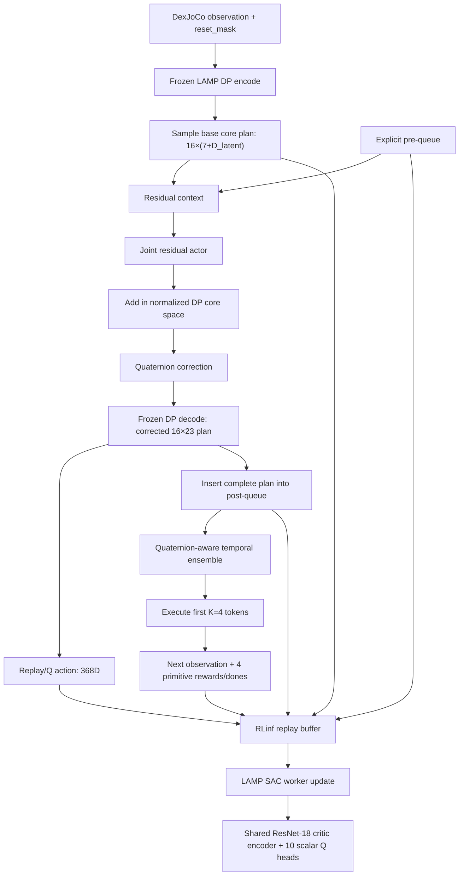

# LAMP 第三阶段迁移：Residual SAC/RLPD 代码、契约与运行说明

> **历史迁移记录：** 本文中的 residual-v3、K=4、``exec4_v3``、demo replay
> 和 LAMP RLPD 内容均已被替代。当前实现只保留 online SAC，使用 K=8 和
> ``exec8_v4``；权威说明位于
> ``docs/source-zh/rst_source/examples/embodied/dexjoco.rst``。

## Residual v3 current contract

> This section supersedes every conflicting queue, full-plan-Q, trainable-critic-
> vision, VQ-residual, replay-v1/v2, and fixed-update statement later in this
> document. Later sections are retained only as migration history.

The current residual path supports `cvae`, `decoder_only`, `pca`, and raw
`mlp` artifacts. Base-policy VQ loading and standalone IL evaluation remain
available, but residual v3 rejects VQ explicitly.

```text
current front/wrist RGB + arm state + hand history
  -> frozen condition[256]
  -> H=16 normalized core residual
  -> full frozen decode[16,23]
  -> crop newest plan to K=4
  -> env / replay / Q action[4,23]
```

There is no residual temporal queue or historical plan averaging. The actor sees
only the frozen condition. The critic sees the condition plus the normalized
executed 92D physical chunk. Demo replay uses schema `exec4_v3`; old full-plan
replay and residual checkpoints are intentionally incompatible.

Causal SAC entropy includes arm tokens `t<4`, CVAE/decoder-only hand tokens
`t<8`, and PCA/raw-MLP coordinates `t<4`. Inactive coordinates are exactly
zero. Async training uses an online-macro-transition warm-up, progressive
residual enable probability, and accumulated UTD budget instead of four fixed
learner rounds.

### Current four-GPU launch commands

`LAMP_TASK` supports `water_plant`, `pick_bucket`, `hammer_nail`,
`fold_glasses`, `click_mouse`, and `pinch_tongs`. `LAMP_PRIOR` supports only
`cvae`, `decoder_only`, `pca`, and `mlp`:

```bash
# Policy Decorator-style online SAC (2 Qs, no demonstrations)
LAMP_TASK=hammer_nail LAMP_PRIOR=cvae \
  bash scripts/run_lamp_residual_v3_online_async_4gpu.sh

# RLPD (10 Qs, exact 50/50 online/demonstration sampling)
LAMP_TASK=hammer_nail LAMP_PRIOR=cvae \
  bash scripts/run_lamp_residual_v3_rlpd_async_4gpu.sh
```

Use `PREFLIGHT_ONLY=1` with either command for a CPU/static preflight that
returns before GPU and Ray checks. Paths can be overridden with
`LAMP_ARTIFACT_PATH`; RLPD additionally accepts `LAMP_DATASET_PATH` and
`LAMP_DEMO_REPLAY_PATH`. These are the authoritative v3 entrypoints; commands
later in this document are retained only as legacy migration history.

## 1. 文档目的

本文说明 LAMP residual RL 迁移到当前 RLinf 仓库后的实现。重点回答：

1. residual actor、完整动作计划、temporal ensemble 和 Q 网络之间是什么关系。
2. 哪些能力直接复用了 RLinf，哪些代码是 LAMP 专用适配。
3. SAC 与可选 RLPD 如何训练、保存和在仿真环境中在线评估。
4. 当前实现已经验证到什么程度，还有哪些实验风险和工程边界。

本文沿用 `LAMP_PHASE2_MIGRATION.md` 的维护者文档组织方式。它是仓库根目录的
迁移说明，不属于 Sphinx 用户文档，因此没有单独的中英文 RST 镜像。

### 1.1 设计来源与优先级

概念设计来源是：

```text
/vepfs-mlp2/c20250301/240906020/RLinf/dexjoco-lamp/docs/
sim_residual_sac_implementation.md
```

实际实现不是照搬该文档中的独立 JAX trainer。决策优先级为：

1. 本轮实验要求：residual 必须与 base policy 位于同一 DP core space；Q 使用
   DP 同源 ResNet-18；RLPD 使用 10 个 Q。
2. 当前 RLinf 已有的 SAC/RLPD、ReplayBuffer、FSDP、Ray、Hydra、日志、保存和
   online evaluation 基础设施。
3. 原设计文档中的 corrected plan、latent 全序列 decode、显式 ensemble queue 和
   macro-transition 语义。

因此，旧文档中独立的 JAX 网络、训练循环和 checkpoint 布局已被 RLinf 原生组件替代；
它提出的状态与动作数学契约则尽量保留。

### 1.2 实现结论

- base policy：Phase 2 生成的单臂 `lamp_dp` CVAE/decoder-only/PCA、raw MLP 或
  VQ artifact，完全冻结。
- residual：一个联合 tanh-Gaussian，输出与 base 的 normalized DP core action 完全
  同空间；continuous prior 为 `[B,16,7+D_latent]`，raw MLP 为 `[B,16,23]`，VQ
  为 `[B,16,8]`，最后一维是排序后 codebook 的 normalized index。
- latent 维度来自 artifact：CVAE-6 的联合随机动作维度为 `16×13=208`；CVAE-2 或
  PCA-2 为 `16×9=144`；VQ 为 `16×8=128`；raw MLP 为 `16×23=368`。
- Q action：完整 corrected decoded physical plan，形状 `[B,16,23]`，展平后 368 维。
- simulator action：将 corrected plan 插入显式 temporal-ensemble queue 后，只执行
  ensemble plan 的前 `K=4` 个 23 维物理动作。
- critic：独立于 frozen DP 的 front/wrist ResNet-18 副本；一个共享 critic encoder，
  后接 10 个独立标量 Q MLP head。
- online SAC：只使用 RLinf 在线 replay。
- RLPD：继续走同一 SAC worker；增加 demo replay 后，每个 batch 固定一半 online、
  一半 demo。
- evaluation：训练期间在 DexJoCo 中 online validation，不是离线 Q loss 评估。

## 2. 总体架构

### 2.1 rollout、replay 和更新链路



actor 与 Q 看到的动作不是环境实际发送的四步 tensor，但二者不是无关的：完整 corrected
plan 被插入 queue，当前四步和剩余 tail 都会通过 queue 影响当前或后续执行。将完整 pre-queue
纳入状态，是让这个 receding-horizon 决策尽量满足 Markov 性的关键。

### 2.2 参数更新边界

| 模块 | 初始化来源 | 是否训练 | 是否同步到 rollout |
|---|---|---:|---:|
| frozen DP front/wrist ResNet-18 | Phase 2 artifact | 否 | rollout 本地加载同一 artifact |
| diffusion base-plan policy | Phase 2 artifact | 否 | rollout 本地加载同一 artifact |
| DP core decoder | Phase 2 artifact 的 CVAE/decoder-only/PCA decoder、raw MLP identity path 或 VQ hard lookup | 否；VQ hard index 不保留 hand-index 的 pathwise Q 梯度 | rollout 本地加载同一 artifact |
| residual actor | 新建 | 是，actor optimizer | 是 |
| critic front/wrist ResNet-18 | 深拷贝 DP artifact 权重 | 是，critic optimizer | 否 |
| critic context encoder | 新建 | 是，critic optimizer | 否 |
| 10 个 Q MLP head | 复用 `MultiQHead` 创建 | 是，critic optimizer | 否 |
| entropy temperature | RLinf `EntropyTemperature` | 是 | 否 |

learner 和 rollout 均加载 frozen artifact，但每次 learner 更新后只同步
`residual_actor.*`。这样避免反复传输两套 critic ResNet-18 和 10 个 Q head。

## 3. 动作、状态和 replay 契约

### 3.1 三种动作不要混淆

| 名称 | 形状 | 含义 | 使用位置 |
|---|---|---|---|
| `base_core` | `[B,16,D_core]` | frozen DP 采样的 normalized core plan | residual context |
| `residual` | `[B,16,D_core]` | actor 输出，默认限制在 `[-0.05,0.05]` | 与 base 同空间相加 |
| `corrected_core` | `[B,16,D_core]` | 相加并修复 quaternion 后的 core plan | frozen DP decoder、queue |
| `corrected_plan` | `[B,16,23]` | 完整 decoded physical plan | Q action、replay `action` |
| `execution_plan[:4]` | `[B,4,23]` | post-queue temporal ensemble 的前四步 | DexJoCo `chunk_step` |

这里选择完整 `corrected_plan` 作为 Q action，是因为 residual 对 16 个 token 同时做决策，
tail 会被保存在 queue 中继续影响未来。不能把 Q action 简化成 6D 机械臂增量，也不能只
保留当前执行的 4×23 动作而丢弃 tail。

### 3.2 quaternion 修正

机械臂 core 的前 7 维为 position 3D 和 `wxyz` quaternion 4D。修正顺序为：

1. 将 base 和 `base+residual` 从 normalized core space 反归一化。
2. 单位化 base quaternion；接近零时回退到 identity。
3. 将 base canonicalize 到 `w>=0`。
4. 单位化 corrected quaternion；接近零时回退到 base。
5. 根据与 base 的内积处理 `q/-q` 符号对齐。
6. 拼回 core action 并重新归一化。

物理计划的 quaternion 在 latent decode 后也会单位化；temporal ensemble 对多个计划的
quaternion 先符号对齐再加权，避免 `q` 和 `-q` 抵消。

### 3.3 显式 queue

`LampEnsembleQueueState` 包含：

| 字段 | 形状 | 说明 |
|---|---|---|
| `core_plans_norm` | `[B,N,16,7+D_latent]` | 每个 slot 的完整 corrected core plan |
| `physical_plans` | `[B,N,16,23]` | 每个 slot 的完整 decoded plan |
| `age_steps` | `[B,N]` | 已消耗 primitive step 数 |
| `valid` | `[B,N]` | slot 是否仍含未消费 token |

默认 `N=4`。每次决策插入一个新计划；slot 未满时使用第一个空位，满时替换年龄最大的
计划。对齐时第 `age_steps` 个 token 成为当前 token。episode reset 只清空对应 batch row。

invalid slot 在归一化后再次乘 mask，防止 action statistics 的非零均值把空 slot 变成非零
context。

### 3.4 replay 的 Phase 3 字段

除 RLinf 标准的 `curr_obs`、`next_obs`、`rewards`、`terminations` 和 `actions` 外，
`forward_inputs` 的训练字段只保存：

- `primitive_valid`：长度为 4 的真实 primitive 有效 mask。
- `action`：展平后的完整 corrected physical plan，368 维。

demo 转换时还可以保存以下仅用于日志的字段：

- `lamp_expert_core_minus_base`：demo expert core 与确定性重建的 sampled base core 之差。
- `lamp_expert_core_action_valid`、`lamp_expert_core_valid`：排除 terminal padding 和 online
  row 的诊断 mask。
- `lamp_expert_{projection,clipped_reconstruction}_rmse`：latent 投影误差以及 residual bound
  截断后的物理计划重建误差。

这些 `lamp_expert_*` 字段不会进入 actor 或 critic，只为 50/50 batch 拼接和 W&B 统计提供
zero-filled online 占位。replay 不保存 sampled base、residual label 或 temporal queue。actor 与
target 每次更新都从 raw observation 重新运行 frozen DP；queue 只是 rollout controller 的
episode-local 状态。这样 demo 的训练内容与 CVAE/PCA prior、latent dim、base checkpoint 和
实验命名解耦，契约与 HIL-SERL 一致：Q 学习 `Q(observation, physical action)`。

旧版只有 observation/action 的 demo 仍需通过 converter 统一 16×23 action、K=4 sparse
reward、terminal 和 `primitive_valid` 语义，但不需要补造 base plan 或 queue。

## 4. Actor 与 Critic

### 4.1 residual actor

actor context 包括：

- frozen DP observation condition；
- 当前 stochastic `base_core`；
- base decoded physical plan。

这些特征拼接后进入与 Policy Decorator 对齐的 `[256,256,256]` ReLU MLP（不使用
LayerNorm），联合输出 `16×(7+D_latent)` 维 mean 和 log standard deviation；例如 Dz=6
为 208 维，Dz=2 为 144 维。
输出层使用小权重初始化，`log_std` 初始值为 `-2`，范围为 `[-5,2]`。采样过程为：

```text
u = mean + exp(log_std) * epsilon
delta = 0.05 * tanh(u)
```

SAC log-probability定义在 `tanh(u)` 的单位 residual 空间。固定 `0.05` 是确定性 action
adapter，不加入 log-Jacobian，否则会给 208 维联合熵引入很大的无意义常数偏移。

### 4.2 critic visual backbone

critic 不使用 RLinf 通用 SAC 的 ResNet-10。构造模型时直接 `deepcopy` frozen DP artifact
中的 front/wrist ResNet-18：

- 初始权重与 base 两个视角逐元素一致；
- 参数 storage 不共享；
- base 始终冻结，critic 副本可训练；
- target critic 的参数和 BatchNorm buffer 通过 EMA 更新。

critic 还接收 raw arm state、8×16 hand history 和由 observation 得到的 frozen condition。
融合 MLP 为 `[512,256]`，输出 256 维 state feature；随后仅与 replay 中的 16×23 physical
action 拼接。sampled base、expert core 和 queue 都不是 Q 的输入。

### 4.3 10 个 Q 网络到底是什么

这里的“10 个 Q 网络”准确地说是：

```text
shared critic encoder: observation/context -> 256D
Q_i: concat(256D state, 368D full plan) -> 256 -> 256 -> 1
i = 1,...,10
```

10 个 Q head 的 MLP 参数彼此独立，但共享同一个可训练 ResNet-18/context encoder。这样
复用了 RLinf 的 `MultiQHead`，并控制视觉计算和显存；它不是 10 套完整 ResNet-18。

## 5. SAC/RLPD 更新语义

### 5.1 K-step macro reward

DexJoCo 一次接收最多 4 个 primitive action。若第 `n<=4` 步结束，后面的 placeholder
reward/action 不属于轨迹。worker 使用环境生成的 `primitive_valid` 计算：

```text
R_t = sum(i=0,...,n-1) gamma^i * r_(t+i)
discount_t = gamma^n
```

这也是“done 后 reward 补 0”的正确解释：0 只是保持 batch tensor 定长，mask 保证这些
位置既不进入 reward return，也不被计为有效时间步。任务成功动作的 reward 仍然保留；
done 后尚未执行的 action 不会因此被错误地视为有意义。

### 5.2 randomized ensembled target

对每个 target 计算，从 10 个 target Q 中无放回随机抽取两个不同 head：

```text
S ~ Uniform(all 2-element subsets of {1,...,10})
Q_target_next = min(Q_target_i(s', a') for i in S)
y = R_t + 1[not terminated] * gamma^n * Q_target_next
```

所有 10 个 online Q 都回归同一个 `y`。当前配置 `backup_entropy: false`，所以 target 中
不减 `alpha*log_pi`；这是 RLPD 风格设置，不是默认 soft-SAC backup。

### 5.3 actor 和温度

actor 使用全部 10 个 Q 的均值，而不是最小值：

```text
J_actor = E[alpha * log pi(a|s) - mean_i Q_i(s,a)]
```

自动温度调节的 joint target entropy 为：

```text
-H * (7 + D_latent)
```

例如 CVAE-6 使用 `-208`，任意 2D continuous prior 使用 `-144`，VQ 使用 `-128`，
raw MLP 使用 `-368`。worker 会根据实际 artifact 的 core dim 在启动时校验该值，切换 core 类型或
latent dim 时不会静默沿用错误 target entropy。

### 5.4 online SAC 与 RLPD 的关系

仓库没有为本实验复制一个独立的 `RLPDTrainer`。二者走同一 worker：

- online SAC config 不声明 `algorithm.demo_buffer`，每个 batch 全部来自 online replay。
- RLPD overlay 声明 demo buffer；RLinf `ReplayBufferDataset` 每次从 online replay 和 demo
  replay 各取 `batch_size//2`，然后执行同一个 10-Q update。

这种实现最大化复用了 RLinf 已有 replay/checkpoint/optimizer 逻辑，也避免 SAC 和 RLPD
形成两套逐渐不一致的 LAMP transition 代码。

## 6. 复用的 RLinf 组件

| 组件 | 复用内容 | LAMP 专用变化 |
|---|---|---|
| `EmbodiedRunner` | rollout→replay→update、验证、保存、日志 | 无新 runner |
| `EmbodiedSACFSDPPolicy` | replay/demo buffer、DataLoader、optimizer、alpha、EMA、checkpoint | 子类覆盖 macro target、actor/Q 聚合和 demo 诊断 |
| `TrajectoryReplayBuffer` | online/demo 存储、采样、自动保存接口 | transition 增加 physical-plan 与 primitive mask 字段 |
| `ReplayBufferDataset` | online-only 或固定 50/50 online/demo batch | 无 |
| `MultiQHead` | 多个独立 scalar Q MLP | head 数设为 10，action dim 设为 368 |
| FSDP strategy | wrapping、gradient accumulation、grad clipping | `no_shard + use_orig_params` 保护冻/训参数分组 |
| patch weight sync | actor→rollout 权重同步 | 只同步 `residual_actor.*` |
| `MetricLogger` | TensorBoard/W&B 等后端 | 增加 LAMP macro target 和 expert-base metrics |
| online evaluation | `val_check_interval` 和独立 eval env | deterministic residual + 固定 DP noise streams |

## 7. 新建模型文件

目录：`rlinf/models/embodiment/lamp/`

### 7.1 `temporal_ensemble.py`

- 定义可 batch、可 detach/clone、可写入 replay 的 `LampEnsembleQueueState`。
- 实现 empty、insert、align、ensemble、advance 和按 row reset。
- temporal ensemble 在 full 16-token tail 上工作，不只缓存前四步。
- quaternion 使用符号对齐加权；函数保持 continuous/raw 路径中的
  actor→decoder→ensemble 梯度，VQ hand index 仍遵循 hard lookup baseline。

### 7.2 `residual_sac.py`

- `LampResidualActor`：联合 `16*D_core` 维 tanh-Gaussian residual。
- `LampResidualCriticEncoder`：DP 初始化的 trainable 双视角 ResNet-18 和 context MLP。
- `LampResidualSACPolicy`：冻结 base、拼 residual、修 quaternion、DP core decode、queue、
  rollout、SAC actor/Q forward 和 eval noise stream 的统一模型。
- `sac_forward` 返回完整 corrected 368D plan；`predict_action_batch` 返回实际执行的
  `[B,4,23]` ensemble 动作。
- train/eval queue 分开维护，online validation 不会覆盖训练 queue。
- 显式拒绝 rollout `torch.compile`，因为 queue lifecycle 尚未纳入稳定 compile contract。

## 8. Worker、环境和入口修改

### 8.1 `fsdp_lamp_residual_sac_policy_worker.py`

继承 `EmbodiedSACFSDPPolicy`，只实现以下专用职责：

- actor/critic 参数过滤和 residual-only weight sync；
- target critic BatchNorm buffer EMA；
- 从 replay 恢复 rollout 时的 base/pre-queue；
- 按实际 `effective_steps` 构造 next queue；
- K-step discounted reward；
- target 随机两个不同 Q 取最小，actor 对 10 Q 取均值；
- 根据 artifact 检查 target entropy。
- RLPD 启动时校验 demo 的 task、artifact checksum、dataset fingerprint、latent shape、
  residual scale 和 queue/reward/action contract。
- 在 mixed batch 中监控有效 demo token 的 `expert_core - sampled_base_core` 分布与可达性。

### 8.2 `env_worker.py`

包含两个与本阶段相关的修改：

1. DexJoCo 执行 chunk 后，用环境返回的真实 `primitive_valid` 替换 rollout 创建的
   stack-safe placeholder，确保 replay 不把 done 后 padding 当作有效动作。
2. 每轮 online validation 显式 reset 仿真环境后，在第一条 observation 中添加全 true
   `reset_mask`，清空上一轮 eval queue 并重新启动固定 DP noise stream。

### 8.3 `huggingface_worker.py`

- 将 `lamp_residual_sac` 纳入本地 PyTorch embodied model 加载路径。
- rollout 调用 `predict_action_batch(..., mode="train"/"eval")`；eval mode 使用 residual
  mean，train mode 使用 Gaussian sample。

### 8.4 训练入口

- `train_embodied_agent.py`：当 `loss_type=embodied_sac` 且 model type 为
  `lamp_residual_sac` 时选择 LAMP 专用 SAC worker，其余 SAC 模型不受影响。
- `train_async.py`：明确拒绝该模型，防止错误回退到不保存显式 queue transition 的 async
  worker。

### 8.5 模型注册与 base loader

- `rlinf/config.py` 注册 `lamp_residual_sac` 并检查 H=16、K=4、action dim 23、10 Q、
  target sample 2、actor mean、transition collection 和 sync-only 边界。
- `rlinf/models/__init__.py` 注册模型构造器。
- `rlinf/models/embodiment/lamp/__init__.py` 先复用 Phase 2 严格 artifact loader 创建
  `lamp_dp`，再包成 residual policy。
- `policy_wrapper.py` 将 physical quaternion 的 in-place 写入改成 functional concat，使
  Q gradient 能在 continuous/raw 路径穿过 frozen decoder 返回 residual actor；VQ hand
  index 的硬解码不提供该 pathwise 梯度。

## 9. Hydra 配置

### 9.1 公共配置

| 文件 | 作用 |
|---|---|
| `examples/embodiment/config/model/lamp_residual_sac.yaml` | actor/Q/queue/seed 模型参数 |
| `examples/embodiment/config/dexjoco_lamp_residual_sac.yaml` | RLinf placement、SAC、replay、env、eval、FSDP 公共配置 |
| `examples/embodiment/config/dexjoco_lamp_residual_sac_raw_dp_hammer_nail.yaml` | selected raw MLP hammer-nail artifact 与 `target_entropy=-368` |
| `examples/embodiment/config/dexjoco_lamp_residual_sac_vq_hammer_nail.yaml` | selected VQ hammer-nail artifact 与 `target_entropy=-128` |
| `examples/embodiment/config/dexjoco_lamp_residual_rlpd_pick_bucket.yaml` | 在 pick-bucket SAC 上增加 demo replay |
| `examples/embodiment/config/dexjoco_lamp_residual_rlpd_water_plant.yaml` | Dz=2 water-plant artifact 的本地磁盘 RLPD 配置 |

当前公共 SAC 默认值包括：48 个 train env、20 个 eval env、global/micro batch 256、每 50
runner step 验证和保存、每轮 rollout 64 primitive step、10 Q、target random 2、
critic/actor update ratio 4 和 residual scale 0.05。selected prior-mode RLPD overlay 将验证
间隔覆盖为 500 runner step。
这些是起点，不是论文最终超参数结论。

### 9.2 六个任务配置

| 任务 | config name | frozen artifact |
|---|---|---|
| click mouse | `dexjoco_lamp_residual_sac_click_mouse` | `outputs/dexjoco_lamp_dp_il_cvae_click_mouse/artifact` |
| fold glasses | `dexjoco_lamp_residual_sac_fold_glasses` | `outputs/dexjoco_lamp_dp_il_cvae_fold_glasses/artifact` |
| hammer nail | `dexjoco_lamp_residual_sac_hammer_nail` | `outputs/dexjoco_lamp_dp_il_cvae_hammer_nail/artifact` |
| hammer nail (raw DP) | `dexjoco_lamp_residual_sac_raw_dp_hammer_nail` | `outputs/lamp_prior_modes_z2_selected_lr3e-5_hammer_nail_fold_glasses/hammer_nail_dp_mlp_lr3e-5/artifact` |
| hammer nail (VQ DP) | `dexjoco_lamp_residual_sac_vq_hammer_nail` | `outputs/lamp_prior_modes_z2_selected_lr3e-5_hammer_nail_fold_glasses/hammer_nail_dp_vq_lr3e-5/artifact` |
| pick bucket | `dexjoco_lamp_residual_sac_pick_bucket` | `outputs/dexjoco_lamp_dp_il_cvae_pick_bucket/artifact` |
| pinch tongs | `dexjoco_lamp_residual_sac_pinch_tongs` | `outputs/dexjoco_lamp_dp_il_cvae_pinch_tongs/artifact` |
| water plant | `dexjoco_lamp_residual_sac_water_plant` | `outputs/dexjoco_lamp_dp_il_cvae_water_plant/artifact` |

建议先用 pick bucket 做短 smoke test，再扩展到其余五个任务。

## 10. 性能评估与日志

### 10.1 SAC 如何评估模型

当前性能评估是训练期间的仿真 online evaluation：

1. `EmbodiedRunner` 每到 `runner.val_check_interval`，先把最新 residual actor 同步到
   rollout worker。
2. `EnvWorker.evaluate()` 重置独立的 `env.eval` DexJoCo 环境。
3. residual actor 使用 deterministic mean；frozen DP 使用配置的可复现 noise streams。
4. 完整跑完 eval episode，按环境信息聚合 return、episode length 和 success。
5. 指标以 `eval/` 前缀写入 TensorBoard。

这不是用训练 replay 做离线 Q loss validation。Q loss 只能说明 Bellman 拟合情况，最终
策略性能仍以 simulator success/return 为准。

默认 `eval_base_noise_seeds: [0,1,2,3,4]` 按 parallel env 循环分配。这样 residual 固定时
仍能观察 frozen DP 基础噪声造成的性能方差。若需要严格论文统计，应让每个 checkpoint
使用相同任务初始 state seeds 和相同 DP noise seed 集合。

### 10.2 主要指标

| 指标 | 含义 |
|---|---|
| `eval/success_once` | eval episode 中是否至少成功一次；主要性能指标 |
| `eval/return` | eval episode 累积环境 reward |
| `eval/episode_len` | eval episode 长度 |
| `train/sac/critic_loss` | 10 个 Q 对共同 target 的均方误差 |
| `train/sac/actor_loss` | entropy-regularized actor objective |
| `train/sac/alpha` | 当前 entropy temperature |
| `train/critic/q_data` | replay action 的平均 Q |
| `train/critic/q_target` | macro Bellman target 均值 |
| `train/critic/effective_steps` | 每个 chunk 实际执行 primitive 数 |
| `train/critic/macro_reward` | chunk 内 discounted reward |
| `train/actor/q_value_0...9` | actor action 在每个 Q head 下的均值 |
| `train/replay_buffer/*` | online replay 大小等统计 |
| `train/demo_buffer/*` | RLPD demo replay 统计，仅 demo 模式存在 |
| `train/critic/expert_core_minus_sampled_base_core/abs_p95` | expert 与 sampled base 的 normalized core 绝对差 p95 |
| `train/critic/expert_core_minus_sampled_base_core/outside_residual_bound_fraction` | 超出当前 residual scale 的坐标比例 |
| `train/critic/expert_core_minus_sampled_base_core/dim_XX_abs_p95` | 每个 arm/latent core 维度的覆盖差异 |
| `train/critic/expert_projection_rmse/*` | CVAE posterior/PCA 投影或 raw MLP 直接归一化后重建物理专家计划的误差 |
| `train/critic/expert_clipped_reconstruction_rmse/*` | delta 截断到 residual bound 后的物理不可达误差 |

最终 key 由环境 info 和 `compute_evaluate_metrics` 聚合；若 DexJoCo 改名，优先查看运行时
打印的 `eval/*` 表，而不要只依赖本文的示例 key。

### 10.3 checkpoint 和恢复

保存和恢复沿用 RLinf SAC worker：

- 周期由 `runner.save_interval` 控制。
- checkpoint 默认位于 logger 路径下的 `checkpoints/global_step_<N>/`。
- actor、critic、target、optimizer、scheduler、alpha 和训练 step 均由现有 worker 保存。
- 恢复时设置 `runner.resume_dir=/absolute/path/to/global_step_<N>`。本次 critic/actor 输入结构
  已变化，重构前保存的 residual checkpoint 参数形状不兼容，必须重新开始 Phase 3 训练；
  新结构产生的 checkpoint 之间仍可正常恢复。

rollout queue 是环境 episode 的瞬时状态，不是参数 checkpoint 的组成部分；恢复训练后从
新环境 reset 开始建立 queue。

## 11. 典型命令

以下命令均从仓库根目录执行：

```bash
cd /vepfs-mlp2/c20250301/240906020/RLinf
source .venv/bin/activate
export MUJOCO_GL=egl
export PYOPENGL_PLATFORM=egl
```

如果本机 Ray 尚未启动：

```bash
ray start --head
```

### 11.1 pick-bucket online SAC

```bash
python examples/embodiment/train_embodied_agent.py \
  --config-name dexjoco_lamp_residual_sac_pick_bucket
```

### 11.2 短 smoke test

```bash
python examples/embodiment/train_embodied_agent.py \
  --config-name dexjoco_lamp_residual_sac_pick_bucket \
  runner.max_steps=2 \
  runner.val_check_interval=1 \
  runner.save_interval=-1 \
  env.train.total_num_envs=2 \
  env.eval.total_num_envs=5
```

该命令仍会启动真实 Ray、FSDP 和 DexJoCo，只是限制为很短的集成检查。本次代码实现没有
自动运行它。

### 11.2a hammer-nail raw DP online SAC

```bash
python examples/embodiment/train_embodied_agent.py \
  --config-name dexjoco_lamp_residual_sac_raw_dp_hammer_nail
```

该配置直接加载 selected raw DP artifact。其 residual 和 target entropy 均按 artifact 的
23D core 计算；不要沿用 continuous-prior 配置的 `-208` 或 `-144`。

### 11.2b Four-GPU fold-glasses prior-mode RLPD

```bash
bash scripts/run_fold_glasses_residual_rlpd_prior_modes_4gpu.sh
```

### 11.2c Four-GPU hammer-nail prior-mode RLPD

```bash
bash scripts/run_hammer_nail_residual_rlpd_prior_modes_4gpu.sh
```

两个入口都会先串行生成或复用五份 artifact-specific demo replay，再按四 GPU 分批启动
raw MLP、PCA-2、CVAE-2、decoder-only CVAE-2 和 VQ 五个训练进程。每个活跃进程的
actor、env 和 rollout 分别固定
到 GPU 0–3；MLP 使用 `target_entropy=-368`，其余三组使用 `-144`。所有 demo-buffer 和
训练超参继承 selected water-plant RLPD recipe，任务数据分别来自用户指定的 direct LeRobot
task root。每个 run 的 checkpoint、TensorBoard/W&B 日志和 eval video 位于：

```text
outputs/lamp_residual_rlpd_prior_modes/<task>/<experiment>/
```

launcher 和转换日志位于 `<task>/launcher_logs/`。公共配置中的 eval video 开关没有被覆盖，
因此仍保存到每个 run 的 `video/eval`。只做无副作用路径/GPU/artifact 检查时运行：

```bash
PREFLIGHT_ONLY=1 bash scripts/run_fold_glasses_residual_rlpd_prior_modes_4gpu.sh
PREFLIGHT_ONLY=1 bash scripts/run_hammer_nail_residual_rlpd_prior_modes_4gpu.sh
```

若本机尚无 Ray，launcher 默认启动一个 4-GPU local head，并在全部进程退出后停止它；已有
Ray cluster 会直接复用且不会被 launcher 停止。可设置 `START_RAY_IF_NEEDED=0` 强制要求
Ray 预先存在，也可用 `OUTPUT_ROOT`、`REPLAY_ROOT`、`CACHE_ROOT` 和 `WANDB_MODE` 调整输出。

### 11.3 转换 water-plant 成功 demo

这是可选的手动转换入口；默认 RLPD 配置也可以在启动训练时自动执行同一条转换逻辑。
转换器直接读取训练 DP 时的 LeRobot dataset 和 artifact 对应的 mmap cache。每条输入轨迹
按成功轨迹处理：非终止 primitive reward 为 0，最后一个有效 primitive reward 为 1 并
termination。critic action 保存真实 expert `[16,23]` 物理计划；converter 不伪造 residual
label。

```bash
python toolkits/replay_buffer/convert_lamp_lerobot_to_residual_replay.py \
  --task water_plant \
  --dataset-root datasets/DexJoCo-Datasets-LeRobot/dexjoco_lerobot_datasets \
  --artifact outputs/lamp_water_plant_hparam/part3/dp_cvae_z2_selected_lr3e-5/artifact \
  --cache-root outputs/lamp_cache \
  --split all \
  --output outputs/lamp_demo_replay/water_plant_all_100
```

converter 根据 artifact 的 `dataset_fingerprint` 自动选择对应 cache。artifact 仅用于读取
数据归一化/可选 expert-core 诊断，不形成 learner 的 checkpoint 兼容性约束。输出目录不能
预先存在；失败时只清理私有 staging 目录。`conversion_report.json` 的 schema version 2
声明 `training_context=observation_and_physical_action_only`，并包含全局及逐维
`expert_core - sampled_base_core`、projection RMSE 和 clipped reachable RMSE。

如需快速检查命令和数据路径，可先增加 `--max-episodes 1`，输出到另一个临时目录；完整
训练仍应重新转换完整 `all` split。当前生成的通用 checkpoint 包含全部 100 条已确认成功
的 expert demo，共 6,972 个 macro transition；Phase 3 的泛化性能由独立仿真 online
evaluation 衡量。

当前 Phase 2 artifact/cache 图像尺寸为 128x128。LAMP residual 配置同时设置
`env.train.observation_image_size=128` 和 `env.eval.observation_image_size=128`；DexJoCo
adapter 在 rollout/replay 之前对 main、wrist 与 extra-view 相机统一做 area resize。因此
online replay 与 train/validation demo 都以 `[128,128,3]` 存储和拼接，不再出现
640x640 online 与 128x128 demo 的 batch 拼接错误。

### 11.4 启动 water-plant RLPD

`algorithm.demo_buffer.load_path` 不能直接指向 LeRobot 原始目录：RLinf loader 读取的是包含
`metadata.json`、`trajectory_index.json`、`conversion_report.json` 和 trajectory `.pt` 的
`TrajectoryReplayBuffer` checkpoint。现在配置支持以下两种模式：

- `load_path` 非空：直接加载并校验已有 replay checkpoint；若传入原始 LeRobot 目录，会在
  Ray worker 启动前给出明确错误。
- `load_path: null`：读取 `offline_lerobot_path`，生成或复用 `generated_load_path`。转换在
  driver 的独立子进程中只执行一次，完成后才启动 actor/rollout/env workers，不会由每个
  FSDP rank 重复生成。

water-plant overlay 默认使用自动模式：

```yaml
algorithm:
  demo_buffer:
    load_path: null
    offline_lerobot_path: ./datasets/DexJoCo-Datasets-LeRobot/dexjoco_lerobot_datasets
    generated_load_path: ./outputs/lamp_demo_replay/water_plant_all_100
    conversion:
      cache_root: ./outputs/lamp_cache
      split: all
      batch_size: 32
      device: auto
      seed: 1234
```

若 `generated_load_path` 已是完整且 task/source 匹配的 schema-v2 checkpoint，启动过程直接
复用；若目录存在但不完整，则停止并保留目录，不会自动覆盖或删除。显式指定旧 schema-v1
checkpoint 仍受兼容，但自动生成目标固定为 schema v2。

```bash
python examples/embodiment/train_embodied_agent.py \
  --config-name dexjoco_lamp_residual_rlpd_water_plant
```

该配置自动解析出完整 demo checkpoint，但内存中只缓存 8 条 trajectory；
`sample_window_size=100` 覆盖 water-plant 的全部 100 条 demo。每个 update batch 固定
为 50% online + 50% demo。

pick-bucket overlay 同样默认自动转换；如需改为加载已有 checkpoint，可覆盖：

```bash
python examples/embodiment/train_embodied_agent.py \
  --config-name dexjoco_lamp_residual_rlpd_pick_bucket \
  algorithm.demo_buffer.load_path=/absolute/path/to/lamp_phase3_demo_replay
```

也可以保留 `load_path=null`，覆盖 `offline_lerobot_path` 与 `generated_load_path` 来自动转换。

### 11.5 恢复训练

```bash
python examples/embodiment/train_embodied_agent.py \
  --config-name dexjoco_lamp_residual_sac_pick_bucket \
  runner.resume_dir=/absolute/path/to/checkpoints/global_step_100
```

### 11.6 快速测试

```bash
.venv/bin/pytest -q \
  tests/unit_tests/test_lamp_phase2.py \
  tests/unit_tests/test_lamp_phase3.py
```

## 12. 已验证内容

### 12.1 单元与兼容性测试

最终 targeted regression 执行结果：

```text
test_lamp_phase2.py + test_lamp_phase3.py
74 passed = 59 Phase 2 + 15 Phase 3
```

Phase 3 的 15 项测试覆盖：

- queue insert/align/advance/reset 和 tail 保留；
- antipodal quaternion ensemble；
- queue 可微路径；
- critic ResNet-18 权重相同但 storage 独立，base 冻结；
- 368D full-plan actor/Q shape 和 10 个 scalar Q；
- Q gradient 分别穿过 frozen decoder-only/PCA decoder 和 raw MLP identity path 到 actor；
- residual scale 不污染单位空间 log-probability；
- Q corrected plan 与 simulator ensemble action 的区分；
- base-relative quaternion canonicalization；
- early done 的 macro reward 与 `gamma^effective_steps`；
- 成功 demo reward、expert queue、PCA/raw MLP projection、mixed-batch diagnostic mask 和 report validation；
- 六任务 Hydra composition、两个 RLPD overlay 和多 DP noise stream 可复现性。

### 12.2 静态和构建检查

- 修改的 Python 文件通过 Ruff format/check。
- residual model、queue 和专用 worker 通过 `compileall`。
- 六个 task config 和两个 RLPD overlay 已成功完成 Hydra compose；六个 SAC config 已通过
  `validate_cfg`。
- 默认六任务 artifact 均为 `lamp_dp + cvae + core_dim=13`；selected water-plant CVAE-2
  artifact 已加载为 `core_dim=9`、144D residual 和 10 Q。
- pick-bucket artifact 已通过真实 builder 加载：base trainable parameter 为 0，Q head
  数为 10，critic front ResNet-18 参数与 base 初始化相同且不共享 storage。

### 12.3 本次未执行

- 没有启动长时间 RL 训练。
- 已完成 PCA-2 的 1-step DexJoCo/Ray rollout smoke test，以及 2-step FSDP SAC 更新
  smoke test；未启动长时间训练。
- 已转换并加载真实 100-episode demo replay（6,972 macro transitions）；已验证所有存储
  图像与真实 online reset 均为 128x128，未启动长期 RLPD 更新或 online evaluation。

## 13. 当前边界与可能不合理之处

### 13.1 完整计划 Q 与实际四步执行存在建模近似

Q 评估 16×23 corrected plan，但环境当前只执行 ensemble 后的前四步。将完整 queue 放入
state、保留 tail，可以使两者形成确定的 receding-horizon 转换；但这仍不是最标准的
“Q action 等于 simulator action”定义。建议至少做以下消融：

- 当前 full corrected plan Q；
- 只对实际 executed 4×23 plan 建 Q；
- 对 post-queue 或 ensemble plan 建 Q。

如果 full-plan Q 学习不稳定，不应直接断定 SAC 无效，应先检查这层 action abstraction。

### 13.2 208 维联合 stochastic action 对 SAC 偏难

动作维度高、reward 稀疏、base 本身带随机性，online-only SAC 的样本效率可能较低。当前
默认 `wrist_residual_scale=0.05`、`hand_residual_scale=0.05`、
`init_log_std=-2` 和 frozen base 用于限制早期破坏。旧配置的
`residual_scale` 仍作为两个分量的 fallback，但仍建议：

- 先确认 zero/near-zero residual 不降低 base success；
- 先用 pick bucket 和 RLPD demo warm start；
- 监控 alpha、actor entropy、各 Q head 分歧和 residual norm；
- 必要时对 horizon/latent 做结构化 actor，而不是无限增大 MLP。

### 13.3 target entropy `-208` 可能过于激进

`-D` 是 RLinf SAC 的直接 joint-action约定，但 208 维下自动温度调节非常敏感。固定 scale
已从 entropy Jacobian 中排除，避免明显错误；论文实验仍应比较较保守的 entropy target
或 fixed alpha。

### 13.4 10 Q head 的多样性有限

10 个 head 共享一个 trainable critic visual/context encoder，多样性主要来自各自 MLP
初始化和随机 target subset。这样计算更可控，但 head 相关性可能较高。若 Q 分歧很快坍缩，
可以考虑 bootstrap mask、独立最后层之前的更深分支，或少量独立 encoder；完整复制 10 套
ResNet-18 的显存和计算成本会非常高。

### 13.5 critic 视觉路径有重复计算

critic 同时接收 frozen DP condition 和自己重新编码的 ResNet-18 features。这满足“Q 使用
DP 同源 ResNet-18”的要求，也给 Q 独立视觉适配能力，但会增加显存并产生特征冗余。可以
消融只用 critic ResNet、只用 frozen condition、或两者融合。

### 13.6 demo latent 不是可辨识的真实 residual label

转换器已实现 CVAE/decoder-only/PCA/raw MLP expert-core 投影和磁盘 replay，但 stochastic DP base
下不存在唯一的“专家 residual label”。
因此 critic 用真实 physical expert action，actor 仍通过当前策略目标更新；core delta 只作为
覆盖率诊断。若 `outside_residual_bound_fraction` 很高或 clipped reconstruction RMSE 很大，
应调整 residual parameterization/bound，而不是把这个 delta 当作监督 residual 强行回归。

### 13.7 evaluation 边界

当前只支持训练过程中的 online simulator validation。独立加载 residual checkpoint 的
standalone evaluation 尚未接线，`runner.only_eval=true` 会被配置校验拒绝。固定预算的
async runner 已支持 Hammer Nail decoder-only RLPD；rollout `torch.compile` 和
base-only/residual-zero eval switch 仍未支持。

### 13.8 `backup_entropy: false` 不是标准 soft-SAC target

当前 target 不包含 `-alpha log pi`，但 actor 和 alpha 仍包含 entropy objective。这与采用的
RLPD 风格配置一致；若论文中需要称为标准 SAC，应补一个 `backup_entropy: true` 对照，而
不是默认把两个公式混为一谈。

## 14. 文件索引

### 14.1 新建实现

| 文件 | 归属 |
|---|---|
| `rlinf/models/embodiment/lamp/temporal_ensemble.py` | LAMP Phase 3 原生 queue |
| `rlinf/models/embodiment/lamp/residual_sac.py` | LAMP residual actor/critic/policy |
| `rlinf/workers/actor/fsdp_lamp_residual_sac_policy_worker.py` | RLinf SAC 专用子类 |
| `rlinf/workers/actor/async_fsdp_lamp_residual_sac_policy_worker.py` | 复用同步数学的 async LAMP 子类 |
| `rlinf/workers/actor/async_fsdp_sac_policy_worker.py` | collector-aware async SAC mixin |
| `rlinf/data/datasets/lamp/residual_replay.py` | 成功 reward、physical replay writer 和可选 expert-core 诊断 |
| `toolkits/replay_buffer/convert_lamp_lerobot_to_residual_replay.py` | LeRobot→本地 RLPD replay converter |
| `tests/unit_tests/test_lamp_phase3.py` | Phase 3 回归测试 |
| `tests/unit_tests/test_lamp_async_sac.py` | 固定预算 async CPU 契约测试 |
| `examples/embodiment/config/model/lamp_residual_sac.yaml` | model config |
| `examples/embodiment/config/dexjoco_lamp_residual_sac.yaml` | 公共 SAC config |
| 六个 `dexjoco_lamp_residual_sac_<task>.yaml` | task overlays |
| `dexjoco_lamp_residual_sac_vq_hammer_nail.yaml` | selected VQ hammer-nail overlay |
| `dexjoco_lamp_residual_rlpd_pick_bucket.yaml` | 可选 RLPD overlay |
| `dexjoco_lamp_residual_rlpd_water_plant.yaml` | selected Dz=2 water-plant RLPD overlay |
| `docs/user_requirements.md` | 已确认需求 |
| `docs/implementation.md` | 实现契约摘要 |
| `docs/dev_log.md` | append-only 开发记录和运行说明 |
| `LAMP_PHASE3_RL_MIGRATION.md` | 本迁移说明 |

### 14.2 修改的接入文件

| 文件 | 修改内容 |
|---|---|
| `rlinf/config.py` | model 注册和 residual SAC validation |
| `rlinf/models/__init__.py` | model builder 注册 |
| `rlinf/models/embodiment/lamp/__init__.py` | frozen DP artifact→residual policy builder |
| `rlinf/models/embodiment/lamp/policy_wrapper.py` | 可微 quaternion normalization |
| `rlinf/workers/rollout/hf/huggingface_worker.py` | rollout model/mode 接入 |
| `rlinf/workers/env/env_worker.py` | primitive-valid 持久化和 eval reset |
| `rlinf/envs/dexjoco/dexjoco_env.py` | 可选 main/wrist/extra-view 统一图像 resize |
| `examples/embodiment/config/env/dexjoco_base.yaml` | 声明可选 `observation_image_size` |
| `tests/unit_tests/test_dexjoco_env.py` | 单/双臂多相机 resize 回归测试 |
| `examples/embodiment/train_embodied_agent.py` | sync worker 路由 |
| `examples/embodiment/train_async.py` | async LAMP worker 路由和 Ray 前 demo replay 准备 |

## 15. 推荐下一步

1. 运行第 11.2 节 pick-bucket 两步 smoke test，先验证真实 Ray/FSDP/DexJoCo 的 shape、
   device、replay 和 weight-sync 生命周期。
2. 增加 residual-zero/base-only eval switch，得到 Phase 2 base success 基线。
3. 先用 `--max-episodes 1` 验证 converter，再生成完整 all-split replay；检查 report 中
   queue error、projection error、delta p95 和 residual-bound coverage 后启动 RLPD。
4. 在短训练中重点看 `eval/success_once`、expert-base coverage、alpha、Q target/data 和 10-head
   分歧，再决定是否开始六任务长训练。
5. 对第 13 节列出的 full-plan Q、entropy target、critic feature 和 `backup_entropy` 做必要
   消融，避免把工程默认值直接当作论文最终设计。

### 15.1 同 checkpoint 关闭历史 temporal ensemble 的评估

`lamp_dp` 的 `rollout.model.use_temporal_ensemble` 默认为 `true`，保持已有推理行为。设为
`false` 后，policy 仍预测完整 `H=16` plan，但只执行最新 plan 的前 `K=4` 步，不保存或
混合历史 plan；这是纯推理消融，不需要重新训练 IL。

三台四卡机器可分别运行以下 launcher。每个 launcher 会用 seed `20260803`、50 个环境，
在四张 GPU 上分批评估对应目录中的两项任务和五种 prior mode，并在结果目录写入
`summary.tsv`，同时列出已有 temporal-ensemble 基线、no-ensemble 结果和差值：

```bash
bash scripts/run_water_plant_pick_bucket_no_temporal_ensemble_eval_4gpu.sh
bash scripts/run_hammer_nail_fold_glasses_no_temporal_ensemble_eval_4gpu.sh
bash scripts/run_click_mouse_pinch_tongs_no_temporal_ensemble_eval_4gpu.sh
```

默认不保存视频。需要视频时设置 `SAVE_VIDEO=true`；需要改变 episode 数或 seed 时分别设置
`EVAL_ENVS`、`EVAL_SEED`。只有默认的 50-env/20260803 组合才会与历史基线计算差值。
设置 `PREFLIGHT_ONLY=1` 可以只检查 artifact 完整性、Python 环境与 Hydra 配置而不启动 GPU
评估。

## 16. Hammer Nail decoder-only async SAC/RLPD

首个 async 生产配置保持同步 LAMP 的算法实现，只替换执行协议：所有四个固定 env shard
到齐后才原子提交一个 collector round；每轮固定授予四个 learner round，每个 learner
round 仍执行 `update_epoch=8`。因此每轮最多产生 32 次 critic 更新，以及通过
`critic_actor_ratio=4` 产生 8 次 actor/alpha 更新；在 `train_actor_steps` 前只训练 critic。

进度拆分为 `collector_step`、`learner_round` 和 `critic_update_step`。runner 的
`max_steps`、eval 和 checkpoint 间隔继续按 `collector_step` 解释。trajectory 记录 rollout
behavior version，权重同步携带递增 learner version；SAC 不丢弃旧策略数据，而是用最多两轮
pending collector 和固定四轮预算约束滞后。

eval/save 只在 collector boundary 发生：train env gate 停止下一轮，当前 round 的四轮学习
完成后阻塞应用最新 residual actor，再运行继承自 base config 的 20-env、seed 42、视频开启
的评估。checkpoint 复用同步 SAC 的 actor/critic/target/optimizer/alpha/replay 内容，并额外
保存 collector、learner budget、critic update、policy version 和在线宏转移计数；半轮数据与
temporal queue 不保存。

生产参数已经全部固定在
`dexjoco_lamp_residual_rlpd_hammer_nail_decoder_only_async.yaml`，推荐直接入口：

```bash
WANDB_MODE=offline MUJOCO_GL=egl PYOPENGL_PLATFORM=egl \
  .venv/bin/python examples/embodiment/train_async.py \
  --config-name dexjoco_lamp_residual_rlpd_hammer_nail_decoder_only_async
```

布局固定为 actor `0-0`、env/rollout `0-3`，共 48 个 train env 和 20 个 eval env。
兼容 shell 仅保留 Ray/GPU 安全检查和可选拓扑 profiling；默认四卡时不再覆盖 YAML
中的训练参数，并用 `tee` 同时输出到终端和 launcher log。

同一训练协议下，selected DP+CVAE z=2 policy 使用独立配置：

```bash
WANDB_MODE=offline MUJOCO_GL=egl PYOPENGL_PLATFORM=egl \
  .venv/bin/python examples/embodiment/train_async.py \
  --config-name dexjoco_lamp_residual_rlpd_hammer_nail_cvae_z2_async
```

首次启动会在 Ray worker 创建前生成 CVAE 专属的
`hammer_nail_dp_cvae_cvae_z2_selected_lr3e-5_base_cache_v3` replay；目标完整后，后续
启动直接复用。该目录与 decoder-only cache 隔离，旧的无 base-context CVAE replay
保持不变。
